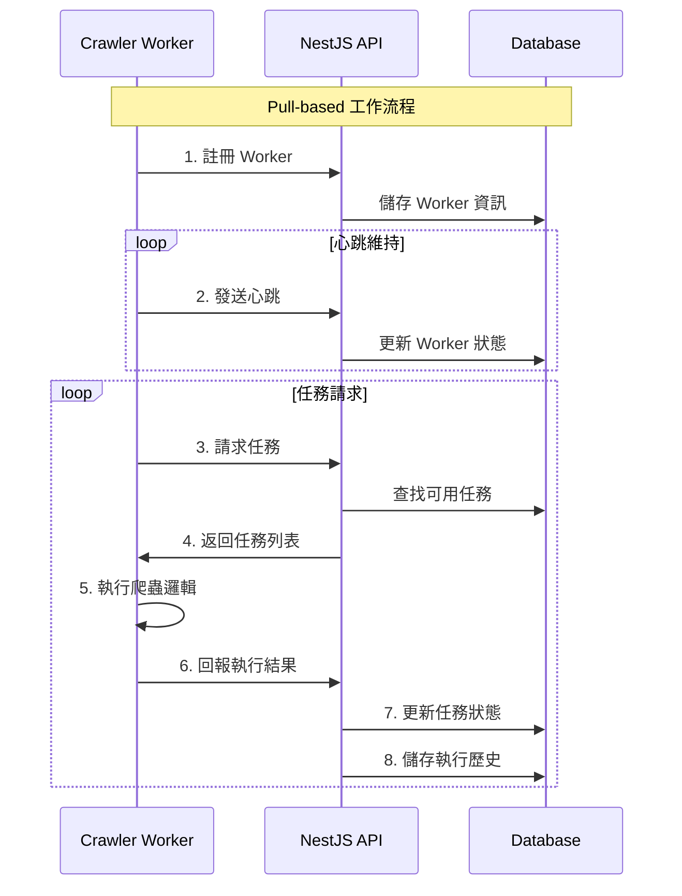

# 爬蟲系統完整指南

**文檔**: AHA 智投系統爬蟲架構  
**創建日期**: 2025-01-17  
**版本**: v1.0  
**類型**: 系統設計文檔

## 目錄

1. [系統架構概述](#系統架構概述)
2. [Pull-based 架構設計](#pull-based-架構設計)
3. [資料流程詳解](#資料流程詳解)
4. [DTO 結構說明](#dto-結構說明)
5. [成功執行範例](#成功執行範例)
6. [失敗處理範例](#失敗處理範例)
7. [實作指南](#實作指南)
8. [與爬蟲系統整合](#與爬蟲系統整合)

## 系統架構概述

AHA 智投系統的爬蟲架構採用分散式 Pull-based 設計，由以下核心組件組成：

```
┌─────────────────────────────────────────────────────────────────┐
│                    爬蟲系統架構 (Pull-based)                     │
├─────────────────────────────────────────────────────────────────┤
│                                                                 │
│  ┌───────────────┐    ┌─────────────────┐    ┌───────────────┐  │
│  │   Crawler     │    │   NestJS API    │    │   Database    │  │
│  │   Workers     │◄──►│   Controllers   │◄──►│   Entities    │  │
│  │               │    │   & Services    │    │               │  │
│  └───────────────┘    └─────────────────┘    └───────────────┘  │
│         ▲                       │                       │       │
│         │                       ▼                       ▼       │
│  ┌───────────────┐    ┌─────────────────┐    ┌───────────────┐  │
│  │   外部爬蟲     │    │   任務調度       │    │   執行歷史     │  │
│  │   系統集成     │    │   管理系統       │    │   失敗記錄     │  │
│  │  (@crawler/)  │    │                 │    │               │  │
│  └───────────────┘    └─────────────────┘    └───────────────┘  │
└─────────────────────────────────────────────────────────────────┘
```

### 核心模組

1. **CrawlerTaskService**: 任務管理和工作者協調
2. **CrawlerWorkerClient**: 工作者客戶端實現
3. **Task/Worker Entities**: 資料持久化層
4. **DTO 層**: 資料傳輸對象定義

## Pull-based 架構設計

### 設計原則

傳統的 Push-based 架構由中央調度器主動分配任務，容易造成單點故障和負載不均。我們採用 Pull-based 架構：

- **工作者主動請求**: Worker 主動向 API 請求任務
- **動態負載平衡**: 根據 Worker 能力和當前負載分配
- **容錯能力**: Worker 可隨時加入或離開系統
- **彈性擴展**: 支援水平擴展 Worker 節點

### 架構優勢



## 資料流程詳解

### 完整資料流程

```
步驟 1: Worker 註冊
├── WorkerRegistrationDto → API
├── 建立 CrawlerWorker Entity
└── 返回 WorkerResponseDto

步驟 2: 心跳維持
├── WorkerHeartbeatDto → API
├── 更新 Worker 狀態
└── 維持線上狀態

步驟 3: 任務請求
├── TaskRequestDto → API
├── 查找符合條件的可用任務
├── 分配任務給 Worker
└── 返回 TaskResponseDto[]

步驟 4: 任務執行
├── 更新任務狀態為 RUNNING
├── 執行爬蟲邏輯 (executeCrawlerLogic)
├── 產生執行結果
└── 清理資源

步驟 5: 結果回報
├── ExecutionResultDto → API
├── 建立 CrawlerHistory Entity
├── 處理失敗情況 (CrawlerFailure)
└── 更新任務最終狀態
```

### 關鍵節點說明

1. **任務分配邏輯**: 
   - 檢查 Worker 能力和負載
   - 按優先級排序可用任務
   - 防止重複分配

2. **狀態管理**:
   - 任務狀態: PENDING → ASSIGNED → RUNNING → COMPLETED/FAILED
   - Worker 狀態: ACTIVE → BUSY → OFFLINE

3. **容錯機制**:
   - 心跳超時自動離線
   - 任務執行超時自動釋放
   - 失敗任務自動重試

## DTO 結構說明

### 核心 DTO 分類

| DTO 類別 | 用途 | 關鍵字段 |
|---------|------|---------|
| **Worker 管理** | | |
| `WorkerRegistrationDto` | 工作者註冊 | `id`, `supported_regions`, `supported_data_types` |
| `WorkerHeartbeatDto` | 心跳更新 | `current_load`, `memory_usage_mb`, `cpu_usage_percent` |
| `TaskRequestDto` | 任務請求 | `supported_regions`, `supported_data_types`, `limit` |
| **任務管理** | | |
| `CreateTaskDto` | 建立任務 | `symbol_code`, `exchange_area`, `data_type` |
| `UpdateTaskStatusDto` | 狀態更新 | `status`, `message` |
| **執行結果** | | |
| `ExecutionResultDto` | 執行結果 | `status`, `records_fetched`, `output_file_path` |
| `FailureReportDto` | 失敗報告 | `category`, `reason`, `message` |

### 重要枚舉定義

```typescript
// 任務狀態
enum TaskStatus {
  PENDING = 'pending',           // 等待分配
  ASSIGNED = 'assigned',         // 已分配
  RUNNING = 'running',           // 執行中
  COMPLETED = 'completed',       // 已完成
  FAILED = 'failed',            // 執行失敗
  TIMEOUT = 'timeout',          // 執行超時
  CANCELLED = 'cancelled'       // 已取消
}

// 失敗分類
enum FailureCategory {
  NETWORK = 'network',          // 網路問題
  PARSING = 'parsing',          // 解析錯誤
  SELECTOR = 'selector',        // 選擇器失敗
  TIMEOUT = 'timeout',          // 超時
  AUTH = 'auth',               // 認證問題
  VALIDATION = 'validation',    // 資料驗證失敗
  SYSTEM = 'system'            // 系統錯誤
}
```

## 成功執行範例

### 完整成功流程

#### 1. Worker 註冊

**請求 Payload**:
```json
{
  "id": "yahoo-finance-crawler-001",
  "name": "Yahoo Finance TW/US Crawler",
  "supported_regions": ["TW", "US"],
  "supported_data_types": ["QUARTERLY", "DAILY"],
  "max_concurrent_tasks": 3,
  "host_info": {
    "hostname": "crawler-server-1",
    "platform": "linux",
    "arch": "x64",
    "nodeVersion": "v18.17.0",
    "memory": 8589934592,
    "cpus": 4
  }
}
```

**回應**:
```json
{
  "id": "yahoo-finance-crawler-001",
  "name": "Yahoo Finance TW/US Crawler",
  "status": "ACTIVE",
  "supported_regions": ["TW", "US"],
  "supported_data_types": ["QUARTERLY", "DAILY"],
  "max_concurrent_tasks": 3,
  "current_load": 0,
  "last_heartbeat": "2025-01-17T10:30:00Z"
}
```

#### 2. 任務請求

**請求 Payload**:
```json
{
  "supported_regions": ["TW", "US"],
  "supported_data_types": ["QUARTERLY"],
  "limit": 3
}
```

**回應 (獲得任務)**:
```json
[
  {
    "id": "task-uuid-001",
    "symbol_code": "2330",
    "exchange_area": "TW",
    "data_type": "QUARTERLY",
    "status": "ASSIGNED",
    "priority": 5,
    "assigned_to": "yahoo-finance-crawler-001",
    "created_at": "2025-01-17T09:00:00Z"
  },
  {
    "id": "task-uuid-002", 
    "symbol_code": "AAPL",
    "exchange_area": "US",
    "data_type": "QUARTERLY",
    "status": "ASSIGNED",
    "priority": 7,
    "assigned_to": "yahoo-finance-crawler-001",
    "created_at": "2025-01-17T09:05:00Z"
  }
]
```

#### 3. 成功執行結果回報

**成功案例 Payload**:
```json
{
  "task_id": "task-uuid-001",
  "status": "SUCCESS",
  "crawled_from": "2023-01-01T00:00:00Z",
  "crawled_to": "2024-12-31T00:00:00Z",
  "records_fetched": 156,
  "records_saved": 154,
  "data_quality_score": 0.95,
  "execution_time_ms": 45000,
  "memory_usage_mb": 128.5,
  "network_requests": 12,
  "output_file_path": "output/yahoo-finance-tw-quarterly-2330-20250117.json",
  "response_summary": {
    "success": true,
    "totalPages": 4,
    "avgResponseTime": 2500,
    "dataSize": 89245,
    "quarters": ["2024-Q4", "2024-Q3", "2024-Q2", "2024-Q1"],
    "metrics": {
      "revenue": 156.2,
      "netIncome": 78.4,
      "eps": 5.23
    }
  }
}
```

**關鍵成功要素**:

1. **資料儲存位置**: `output_file_path` 指向實際的 JSON 檔案
2. **資料品質評分**: `data_quality_score` 反映資料完整性
3. **詳細回應摘要**: `response_summary` 包含結構化的爬取結果
4. **效能指標**: 執行時間、記憶體使用、網路請求次數

### 資料檔案格式範例

**儲存在 `output_file_path` 的資料格式**:
```json
{
  "metadata": {
    "symbol_code": "2330",
    "exchange_area": "TW", 
    "data_type": "QUARTERLY",
    "crawled_at": "2025-01-17T10:45:00Z",
    "source_url": "https://tw.stock.yahoo.com/quote/2330.TW/financials",
    "data_quality_score": 0.95
  },
  "quarters": [
    {
      "period": "2024-Q4",
      "revenue": 156.2,
      "gross_profit": 89.5,
      "operating_income": 45.8,
      "net_income": 78.4,
      "eps": 5.23,
      "currency": "TWD",
      "unit": "billion"
    },
    {
      "period": "2024-Q3", 
      "revenue": 147.8,
      "gross_profit": 85.2,
      "operating_income": 42.1,
      "net_income": 71.6,
      "eps": 4.98,
      "currency": "TWD",
      "unit": "billion"
    }
  ],
  "summary": {
    "total_quarters": 8,
    "latest_quarter": "2024-Q4",
    "yoy_growth": 12.5,
    "avg_eps": 5.1
  }
}
```

## 失敗處理範例

### 失敗分類系統

我們的失敗處理系統提供詳細的錯誤分類，幫助診斷和自動重試：

#### 1. 網路相關失敗

**失敗案例 Payload**:
```json
{
  "task_id": "task-uuid-003",
  "status": "FAILED",
  "execution_time_ms": 30000,
  "memory_usage_mb": 64.2,
  "network_requests": 3,
  "records_fetched": 0,
  "records_saved": 0,
  "data_quality_score": 0,
  "error": {
    "category": "NETWORK",
    "reason": "CONNECTION_TIMEOUT",
    "message": "Connection timeout after 30 seconds",
    "error_code": "TIMEOUT_001",
    "request_url": "https://finance.yahoo.com/quote/AAPL/financials",
    "response_status": null,
    "response_headers": {},
    "selector_used": null,
    "page_content_sample": null
  }
}
```

#### 2. 選擇器失敗

**失敗案例 Payload**:
```json
{
  "task_id": "task-uuid-004",
  "status": "FAILED", 
  "execution_time_ms": 15000,
  "memory_usage_mb": 95.8,
  "network_requests": 5,
  "records_fetched": 0,
  "records_saved": 0,
  "data_quality_score": 0,
  "error": {
    "category": "SELECTOR",
    "reason": "SELECTOR_FAILED",
    "message": "Required selector not found: table.financial-data",
    "error_code": "SELECTOR_001",
    "request_url": "https://tw.stock.yahoo.com/quote/2330.TW/financials",
    "response_status": 200,
    "response_headers": {
      "content-type": "text/html; charset=utf-8",
      "content-length": "125840"
    },
    "selector_used": "table.financial-data tr:nth-child(2) td:last-child",
    "page_content_sample": "<html><head><title>台積電 (2330) 財務報表...</title></head><body><div class='main-content'>..."
  }
}
```

#### 3. 資料解析失敗

**失敗案例 Payload**:
```json
{
  "task_id": "task-uuid-005",
  "status": "FAILED",
  "execution_time_ms": 8000,
  "memory_usage_mb": 72.1,
  "network_requests": 2,
  "records_fetched": 5,
  "records_saved": 0,
  "data_quality_score": 0.1,
  "error": {
    "category": "PARSING", 
    "reason": "PARSING_ERROR",
    "message": "Failed to parse financial value: 'N/A千元'",
    "error_code": "PARSE_001",
    "request_url": "https://tw.stock.yahoo.com/quote/1234.TW/financials",
    "response_status": 200,
    "response_headers": {
      "content-type": "text/html; charset=utf-8"
    },
    "selector_used": "tr:has(td:contains('營收')) td:nth-child(2)",
    "page_content_sample": "<tr><td>營收</td><td>N/A千元</td><td>未公布</td></tr>"
  }
}
```

### 錯誤處理策略

#### 自動重試規則

```typescript
// 重試策略配置
const RETRY_STRATEGIES = {
  [FailureCategory.NETWORK]: {
    maxRetries: 3,
    backoffMultiplier: 2,
    baseDelay: 5000
  },
  [FailureCategory.TIMEOUT]: {
    maxRetries: 2, 
    backoffMultiplier: 1.5,
    baseDelay: 10000
  },
  [FailureCategory.SELECTOR]: {
    maxRetries: 1,
    backoffMultiplier: 1,
    baseDelay: 0
  },
  [FailureCategory.PARSING]: {
    maxRetries: 1,
    backoffMultiplier: 1, 
    baseDelay: 0
  }
};
```

#### 失敗通知和監控

失敗任務會被記錄到 `CrawlerFailure` 實體，並觸發以下動作：

1. **立即通知**: 嚴重錯誤立即通知管理員
2. **統計分析**: 定期分析失敗模式
3. **自動修復**: 某些錯誤類型支援自動修復
4. **配置調整**: 根據失敗模式調整爬蟲配置

## 實作指南

### 繼承 CrawlerWorkerClient

要實作一個具體的爬蟲 Worker，需要繼承 `CrawlerWorkerClient` 並實現核心方法：

```typescript
import { CrawlerWorkerClient, CrawlerWorkerConfig, CrawlerExecutionResult } from '@/crawler/workers/crawler-worker.client';
import { TaskResponseDto } from '@/common/dtos/crawler-task.dto';

export class YahooFinanceCrawler extends CrawlerWorkerClient {
  constructor() {
    const config: CrawlerWorkerConfig = {
      workerId: 'yahoo-finance-worker-001',
      workerName: 'Yahoo Finance Crawler',
      apiBaseUrl: 'http://localhost:3000/api/crawler',
      supportedRegions: [ExchangeArea.TW, ExchangeArea.US],
      supportedDataTypes: [DataType.QUARTERLY, DataType.DAILY],
      maxConcurrentTasks: 3,
      heartbeatInterval: 30000,
      taskRequestInterval: 10000
    };
    
    super(config);
  }

  /**
   * 實作具體的爬蟲邏輯
   */
  protected async executeCrawlerLogic(
    task: TaskResponseDto,
    context: TaskExecutionContext
  ): Promise<CrawlerExecutionResult> {
    const startTime = Date.now();
    
    try {
      // 1. 準備爬蟲配置
      const crawlerConfig = await this.prepareCrawlerConfig(task);
      
      // 2. 執行外部爬蟲系統
      const crawlResult = await this.invokeCrawlerSystem(crawlerConfig);
      
      // 3. 處理爬取結果
      const processedResult = await this.processResults(crawlResult, task);
      
      // 4. 儲存到檔案系統
      const outputPath = await this.saveResults(processedResult, task);
      
      // 5. 計算效能指標
      const metrics = this.calculateMetrics(startTime, processedResult, context);
      
      return {
        success: true,
        data: processedResult,
        metrics: {
          ...metrics,
          outputFilePath: outputPath
        }
      };
      
    } catch (error) {
      const executionTime = Date.now() - startTime;
      const memUsage = process.memoryUsage();
      
      return {
        success: false,
        error,
        metrics: {
          executionTime,
          memoryUsage: memUsage.heapUsed / 1024 / 1024,
          networkRequests: context.metrics.networkRequests,
          recordsFetched: 0,
          recordsSaved: 0,
          dataQualityScore: 0
        }
      };
    }
  }

  /**
   * 準備爬蟲配置
   */
  private async prepareCrawlerConfig(task: TaskResponseDto): Promise<any> {
    // 根據任務資訊生成配置
    const configPath = `config/yahoo-finance-${task.exchange_area.toLowerCase()}-${task.data_type.toLowerCase()}-${task.symbol_code}.json`;
    
    return {
      symbol_code: task.symbol_code,
      exchange_area: task.exchange_area,
      data_type: task.data_type,
      config_file_path: configPath,
      output_directory: 'output/',
      timeout: 60000,
      retries: 3
    };
  }

  /**
   * 調用外部爬蟲系統
   */
  private async invokeCrawlerSystem(config: any): Promise<any> {
    // 這裡整合 @crawler/ 系統
    const { spawn } = await import('child_process');
    
    return new Promise((resolve, reject) => {
      const crawlerProcess = spawn('npx', [
        'tsx', 
        'src/cli.ts',
        '--config', config.config_file_path,
        '--symbol', config.symbol_code
      ], {
        cwd: '../crawler',
        stdio: ['pipe', 'pipe', 'pipe']
      });

      let output = '';
      let error = '';

      crawlerProcess.stdout.on('data', (data) => {
        output += data.toString();
      });

      crawlerProcess.stderr.on('data', (data) => {
        error += data.toString();
      });

      crawlerProcess.on('close', (code) => {
        if (code === 0) {
          try {
            const result = JSON.parse(output);
            resolve(result);
          } catch (parseError) {
            reject(new Error(`Failed to parse crawler output: ${parseError.message}`));
          }
        } else {
          reject(new Error(`Crawler process failed with code ${code}: ${error}`));
        }
      });

      // 設定超時
      setTimeout(() => {
        crawlerProcess.kill('SIGTERM');
        reject(new Error('Crawler execution timeout'));
      }, config.timeout);
    });
  }

  /**
   * 處理爬取結果
   */
  private async processResults(crawlResult: any, task: TaskResponseDto): Promise<any> {
    // 驗證和清理爬取的資料
    if (!crawlResult || !crawlResult.data) {
      throw new Error('Empty crawler result');
    }

    // 資料品質檢查
    const qualityScore = this.assessDataQuality(crawlResult.data);
    if (qualityScore < 0.5) {
      throw new Error(`Data quality too low: ${qualityScore}`);
    }

    return {
      ...crawlResult,
      metadata: {
        symbol_code: task.symbol_code,
        exchange_area: task.exchange_area,
        data_type: task.data_type,
        crawled_at: new Date().toISOString(),
        data_quality_score: qualityScore
      }
    };
  }

  /**
   * 儲存結果到檔案
   */
  private async saveResults(result: any, task: TaskResponseDto): Promise<string> {
    const fs = await import('fs');
    const path = await import('path');
    
    const outputDir = 'output';
    const timestamp = new Date().toISOString().split('T')[0].replace(/-/g, '');
    const filename = `yahoo-finance-${task.exchange_area.toLowerCase()}-${task.data_type.toLowerCase()}-${task.symbol_code}-${timestamp}.json`;
    const outputPath = path.join(outputDir, filename);

    // 確保輸出目錄存在
    await fs.promises.mkdir(outputDir, { recursive: true });
    
    // 儲存結果
    await fs.promises.writeFile(
      outputPath, 
      JSON.stringify(result, null, 2),
      'utf-8'
    );

    return outputPath;
  }

  /**
   * 評估資料品質
   */
  private assessDataQuality(data: any): number {
    let score = 1.0;
    
    // 檢查必要欄位
    const requiredFields = ['quarters', 'metadata'];
    for (const field of requiredFields) {
      if (!data[field]) {
        score -= 0.3;
      }
    }
    
    // 檢查資料完整性
    if (data.quarters && Array.isArray(data.quarters)) {
      const validQuarters = data.quarters.filter(q => 
        q.period && q.revenue !== null && q.revenue !== undefined
      );
      
      const completeness = validQuarters.length / data.quarters.length;
      score *= completeness;
    }
    
    return Math.max(0, Math.min(1, score));
  }

  /**
   * 計算效能指標
   */
  private calculateMetrics(startTime: number, result: any, context: TaskExecutionContext): any {
    const executionTime = Date.now() - startTime;
    const memUsage = process.memoryUsage();
    
    const recordsFetched = result.quarters ? result.quarters.length : 0;
    const recordsSaved = recordsFetched; // 假設全部儲存成功
    
    return {
      executionTime,
      memoryUsage: memUsage.heapUsed / 1024 / 1024,
      networkRequests: context.metrics.networkRequests,
      recordsFetched,
      recordsSaved,
      dataQualityScore: result.metadata?.data_quality_score || 0
    };
  }
}
```

### 啟動 Worker

```typescript
// worker-startup.ts
import { YahooFinanceCrawler } from './yahoo-finance-crawler';

async function startCrawlerWorker() {
  const worker = new YahooFinanceCrawler();
  
  // 設定事件監聽
  worker.on('started', (data) => {
    console.log(`Worker started: ${data.workerId}`);
  });
  
  worker.on('taskReceived', (data) => {
    console.log(`Received ${data.count} tasks`);
  });
  
  worker.on('taskCompleted', (data) => {
    console.log(`Task completed: ${data.taskId}`);
  });
  
  worker.on('taskFailed', (data) => {
    console.error(`Task failed: ${data.taskId}`, data.error);
  });
  
  worker.on('error', (error) => {
    console.error('Worker error:', error);
  });
  
  // 啟動 Worker
  await worker.start();
  
  // 優雅停止處理
  process.on('SIGINT', async () => {
    console.log('Shutting down worker...');
    await worker.stop();
    process.exit(0);
  });
}

startCrawlerWorker().catch(console.error);
```

## 與爬蟲系統整合

### 與 @crawler/ 系統的整合架構

```
┌─────────────────────────────────────────────────────────────────┐
│                     系統整合架構                                  │
├─────────────────────────────────────────────────────────────────┤
│                                                                 │
│  ┌───────────────────────────────────────────────────────────┐  │
│  │                @finance-strategy/                         │  │
│  │  ┌─────────────────┐    ┌─────────────────────────────┐   │  │
│  │  │  Crawler Task   │    │    Crawler Worker Client    │   │  │
│  │  │   Service       │◄──►│                             │   │  │
│  │  │                 │    │  - 任務接收                   │   │  │
│  │  │  - 任務管理      │    │  - 狀態回報                   │   │  │
│  │  │  - Worker 協調  │    │  - 結果處理                   │   │  │
│  │  └─────────────────┘    └─────────────────────────────┘   │  │
│  └───────────────────────────────────────────────────────────┘  │
│                               │                                 │
│                               ▼                                 │
│  ┌───────────────────────────────────────────────────────────┐  │
│  │                     @crawler/                             │  │
│  │  ┌─────────────┐  ┌─────────────┐  ┌─────────────────┐   │  │
│  │  │   CLI Tool  │  │   Config    │  │   Transform     │   │  │
│  │  │             │  │   System    │  │   Engine        │   │  │
│  │  │  - 命令執行  │  │             │  │                 │   │  │
│  │  │  - 參數處理  │  │  - JSON配置 │  │  - 資料轉換      │   │  │
│  │  │  - 結果輸出  │  │  - 動態生成 │  │  - 品質檢查      │   │  │
│  │  └─────────────┘  └─────────────┘  └─────────────────┘   │  │
│  └───────────────────────────────────────────────────────────┘  │
└─────────────────────────────────────────────────────────────────┘
```

### 整合實作細節

#### 1. 配置檔案管理

Worker 需要根據任務動態選擇或生成配置檔案：

```typescript
/**
 * 配置檔案選擇策略
 */
class ConfigManager {
  private getConfigPath(task: TaskResponseDto): string {
    const { symbol_code, exchange_area, data_type } = task;
    
    // 配置檔案命名規則
    return `config/yahoo-finance-${exchange_area.toLowerCase()}-${data_type.toLowerCase()}-${symbol_code}.json`;
  }
  
  private async ensureConfigExists(configPath: string, task: TaskResponseDto): Promise<void> {
    const fs = await import('fs');
    
    if (!await this.fileExists(configPath)) {
      // 使用配置生成器建立配置
      await this.generateConfig(configPath, task);
    }
  }
  
  private async generateConfig(configPath: string, task: TaskResponseDto): Promise<void> {
    // 根據任務類型選擇配置模板
    const template = await this.getConfigTemplate(task);
    
    // 客製化配置
    const config = {
      ...template,
      symbol_code: task.symbol_code,
      output_file: `output/yahoo-finance-${task.exchange_area.toLowerCase()}-${task.data_type.toLowerCase()}-${task.symbol_code}-{timestamp}.json`
    };
    
    // 儲存配置檔案
    const fs = await import('fs');
    await fs.promises.writeFile(configPath, JSON.stringify(config, null, 2));
  }
}
```

#### 2. 程序間通訊

使用子程序執行爬蟲，並處理輸入輸出：

```typescript
/**
 * 爬蟲程序管理器
 */
class CrawlerProcessManager {
  async executeCrawler(config: CrawlerConfig): Promise<CrawlerResult> {
    const { spawn } = await import('child_process');
    
    return new Promise((resolve, reject) => {
      // 啟動爬蟲程序
      const process = spawn('npx', [
        'tsx', 'src/cli.ts',
        '--config', config.configPath,
        '--symbol', config.symbolCode,
        '--output-format', 'json'
      ], {
        cwd: '../crawler',
        stdio: ['pipe', 'pipe', 'pipe'],
        env: {
          ...process.env,
          NODE_ENV: 'production'
        }
      });

      let stdout = '';
      let stderr = '';

      // 收集輸出
      process.stdout.on('data', (data) => {
        stdout += data.toString();
      });

      process.stderr.on('data', (data) => {
        stderr += data.toString();
      });

      // 處理程序結束
      process.on('close', (code) => {
        if (code === 0) {
          try {
            const result = this.parseOutput(stdout);
            resolve(result);
          } catch (error) {
            reject(new Error(`Failed to parse output: ${error.message}`));
          }
        } else {
          reject(new Error(`Process failed with code ${code}: ${stderr}`));
        }
      });

      // 超時處理
      const timeout = setTimeout(() => {
        process.kill('SIGTERM');
        reject(new Error('Crawler execution timeout'));
      }, config.timeout || 300000);

      process.on('close', () => clearTimeout(timeout));
    });
  }

  private parseOutput(output: string): CrawlerResult {
    // 解析爬蟲輸出
    const lines = output.split('\n');
    const resultLine = lines.find(line => line.startsWith('RESULT:'));
    
    if (!resultLine) {
      throw new Error('No result found in crawler output');
    }
    
    const resultJson = resultLine.substring('RESULT:'.length);
    return JSON.parse(resultJson);
  }
}
```

#### 3. 資料流整合

確保資料從爬蟲系統順利流入後端資料庫：

```typescript
/**
 * 資料整合管理器
 */
class DataIntegrationManager {
  async processAndStore(crawlerResult: any, task: TaskResponseDto): Promise<string> {
    // 1. 驗證爬取結果
    this.validateCrawlerResult(crawlerResult);
    
    // 2. 轉換為標準格式
    const standardizedData = this.standardizeData(crawlerResult, task);
    
    // 3. 儲存到檔案系統
    const outputPath = await this.saveToFile(standardizedData, task);
    
    // 4. 可選：直接儲存到資料庫
    if (this.shouldSaveToDatabase(task)) {
      await this.saveToDatabase(standardizedData, task);
    }
    
    return outputPath;
  }

  private validateCrawlerResult(result: any): void {
    if (!result || typeof result !== 'object') {
      throw new Error('Invalid crawler result format');
    }
    
    // 檢查必要欄位
    const requiredFields = ['data', 'metadata'];
    for (const field of requiredFields) {
      if (!(field in result)) {
        throw new Error(`Missing required field: ${field}`);
      }
    }
  }

  private standardizeData(result: any, task: TaskResponseDto): StandardizedData {
    return {
      metadata: {
        symbol_code: task.symbol_code,
        exchange_area: task.exchange_area,
        data_type: task.data_type,
        crawled_at: new Date().toISOString(),
        source: 'yahoo-finance',
        version: '1.0'
      },
      data: result.data,
      quality_metrics: {
        completeness: this.calculateCompleteness(result.data),
        accuracy: this.estimateAccuracy(result.data),
        freshness: this.calculateFreshness(result.metadata?.crawled_at)
      }
    };
  }
}
```

### 部署和監控

#### 容器化部署

```dockerfile
# Dockerfile for Crawler Worker
FROM node:18-alpine

WORKDIR /app

# 安裝依賴
COPY package*.json ./
RUN npm ci --only=production

# 複製源碼
COPY src/ ./src/
COPY dist/ ./dist/

# 設定環境變數
ENV NODE_ENV=production
ENV CRAWLER_API_URL=http://finance-strategy:3000/api/crawler
ENV CRAWLER_WORKER_ID=yahoo-finance-worker

# 啟動 Worker
CMD ["node", "dist/workers/yahoo-finance-worker.js"]
```

#### 監控和警報

```typescript
/**
 * Worker 監控系統
 */
class WorkerMonitor {
  private metrics = {
    tasksCompleted: 0,
    tasksFailed: 0,
    avgExecutionTime: 0,
    lastHeartbeat: new Date()
  };

  startMonitoring(worker: CrawlerWorkerClient): void {
    // 監控任務完成
    worker.on('taskCompleted', (data) => {
      this.metrics.tasksCompleted++;
      this.updateAvgExecutionTime(data.executionTime);
    });

    // 監控任務失敗
    worker.on('taskFailed', (data) => {
      this.metrics.tasksFailed++;
      this.alertOnHighFailureRate();
    });

    // 監控心跳
    worker.on('heartbeat', () => {
      this.metrics.lastHeartbeat = new Date();
    });

    // 定期報告
    setInterval(() => {
      this.reportMetrics();
    }, 60000); // 每分鐘報告
  }

  private alertOnHighFailureRate(): void {
    const totalTasks = this.metrics.tasksCompleted + this.metrics.tasksFailed;
    const failureRate = this.metrics.tasksFailed / totalTasks;
    
    if (failureRate > 0.1) { // 失敗率超過 10%
      console.warn(`High failure rate detected: ${failureRate * 100}%`);
      // 發送警報到監控系統
    }
  }
}
```

## 結論

這份文檔涵蓋了 AHA 智投系統爬蟲架構的完整實作指南，包含：

1. **架構設計**: Pull-based 分散式架構提供高可用性和擴展性
2. **資料流程**: 清晰的任務生命週期和狀態管理
3. **錯誤處理**: 完善的失敗分類和自動重試機制
4. **實作指南**: 具體的程式碼範例和最佳實踐
5. **系統整合**: 與外部爬蟲系統的無縫整合

通過遵循這些指南，開發者可以：

- 快速實作新的爬蟲 Worker
- 理解資料如何從爬取到儲存的完整流程
- 有效處理各種錯誤情況
- 建立可監控和維護的爬蟲系統

---

**文檔版本**: v1.0  
**最後更新**: 2025-01-17  
**維護者**: AHA 智投開發團隊