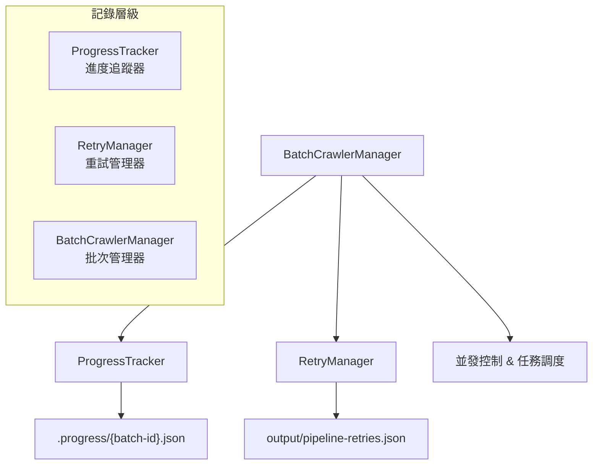
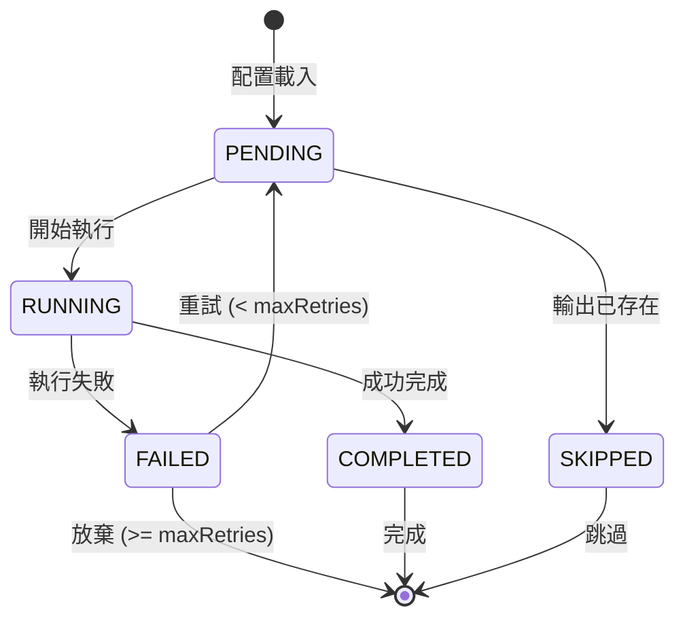

# Pipeline Retry & Batch 功能完整指南

**版本**: v3.1.2  
**更新日期**: 2025-08-17  
**適用系統**: Universal Web Crawler

## 🎯 概述

Universal Web Crawler v3.1.2 提供完整的重試機制和批次處理功能，包含智慧錯誤分類、Site-based Concurrency 控制以及跳過任務重試功能，確保大規模數據爬取的穩定性和可靠性。本指南詳細說明重試機制的工作原理、批次處理功能、以及最佳實踐。

### 🆕 v3.1.2 新特性
- **跳過任務重試功能**: 允許強制重試被標記為 SKIP 的任務，突破傳統限制
- **Enhanced CLI 參數**: 新增 --retry-all, --retry-skipped-only, --force-retry, --reset-attempts
- **進度重置腳本**: reset-progress-status.ts 提供完整的進度狀態管理
- **智慧錯誤分類**: 自動區分暫時性/永久性錯誤，採用不同重試策略
- **Site-based Concurrency**: 按網站域名的智慧並發控制，20% 性能提升
- **增強重試邏輯**: 指數退避延遲 + 隨機抖動，避免系統過載
- **完整進度追蹤**: 三層記錄系統，支援精確斷點續傳

## 🏗️ 三層記錄系統架構

Universal Web Crawler 採用三層記錄系統來管理大量配置文件的執行狀態，確保在處理數千個配置時能準確追蹤每個文件的執行情況並支援斷點續傳。

### 📊 系統架構概覽



### 🎯 各層職責

#### 1. **BatchCrawlerManager (批次管理器)**
- **主要職責**: 協調整體執行流程
- **功能特色**:
  - 生成唯一批次 ID
  - 管理並發執行（預設3個）
  - 控制執行延遲和重試策略
  - 協調 ProgressTracker 和 RetryManager

#### 2. **ProgressTracker (進度追蹤器)**
- **主要職責**: 實時追蹤每個配置文件的執行狀態
- **存儲位置**: `.progress/{batch-id}.json`
- **核心功能**:
  - 記錄每個配置的狀態（pending/running/completed/failed/skipped）
  - 自動每30秒保存進度
  - 支援斷點續傳
  - 計算執行統計和預估時間

#### 3. **RetryManager (重試管理器)**
- **主要職責**: 管理失敗項目的重試隊列
- **存儲位置**: `output/pipeline-retries.json`
- **核心功能**:
  - 記錄失敗原因和重試次數
  - 指數退避重試策略
  - 自動清理過期記錄（7天）
  - 智能重試排程

### 🔄 工作流程

```
1. BatchCrawlerManager 啟動
   ↓
2. 掃描配置文件 & 生成批次 ID
   ↓
3. ProgressTracker 初始化 (.progress/{batch-id}.json)
   ↓
4. 並發執行配置文件
   ├─ 成功 → ProgressTracker 標記 completed
   └─ 失敗 → RetryManager 加入重試隊列
   ↓
5. 自動保存進度 (每30秒)
   ↓
6. 支援中斷後續傳
```

## 📊 重試機制 (Retry System)

### 🗂️ 數據存儲

#### 重試記錄存儲位置
```
output/pipeline-retries.json
```

#### 重試記錄結構
```typescript
interface RetryRecord {
  configFile: string;        // 配置檔案路徑
  symbolCode: string;        // 股票代碼 (如: "2330", "AAPL")
  reportType: string;        // 報表類型 (eps, balance-sheet, cash-flow-statement)
  region: string;            // 市場區域 (TW, US, JP)
  timestamp: string;         // 記錄建立時間 (ISO格式)
  reason: 'empty_data' | 'execution_failed' | 'timeout';
  retryCount: number;        // 當前重試次數 (1-3)
  maxRetries: number;        // 最大重試次數 (預設: 3)
  lastRetryAt?: string;      // 最後重試時間
}
```

#### 重試記錄範例
```json
[
  {
    "configFile": "config-categorized/quarterly/tw/yahoo-finance-tw-eps-2330_TW.json",
    "symbolCode": "2330",
    "reportType": "eps",
    "region": "TW",
    "timestamp": "2025-08-15T10:30:00.000Z",
    "reason": "empty_data",
    "retryCount": 1,
    "maxRetries": 3,
    "lastRetryAt": "2025-08-15T10:35:00.000Z"
  }
]
```

### 🔄 重試觸發條件

#### 1. 空數據檢測 (empty_data)
```typescript
// 觸發條件
- 爬取成功但數據為空
- 財務數據陣列長度為 0
- 關鍵欄位缺失或無效

// 自動檢測項目
- fiscalPeriods: 期間數據
- eps/revenue/cash-flow 數值陣列
- 結構化數據格式驗證
```

#### 2. 執行失敗 (execution_failed)
```typescript
// 觸發條件
- 網頁載入失敗
- CSS 選擇器找不到元素
- JavaScript 執行錯誤
- 網路連接問題

// 錯誤類型
- Playwright 瀏覽器錯誤
- 頁面超時 (預設: 10分鐘)
- 記憶體不足
```

#### 3. 超時錯誤 (timeout)
```typescript
// 觸發條件
- 單個配置執行超過時間限制
- 網頁載入超時
- 數據處理超時

// 預設超時設定
- 頁面載入: 30秒
- 單個配置: 10分鐘
- 批次處理: 60分鐘
```

### ⚙️ 重試策略

#### 指數退避延遲 (Exponential Backoff)
```typescript
// 延遲計算公式
delay = baseDelay * Math.pow(2, retryCount - 1)

// 實際延遲時間
第1次重試: 5秒    (5000ms * 2^0)
第2次重試: 10秒   (5000ms * 2^1)
第3次重試: 20秒   (5000ms * 2^2)
```

#### 重試限制
- **最大重試次數**: 3次 (可配置)
- **最大隊列長度**: 1000項目
- **過期清理**: 7天自動清理
- **記憶體保護**: 大隊列自動分批處理

### 🧠 智慧錯誤分類與策略 (v3.1.1)

#### 錯誤類型自動分類

##### 1. 暫時性錯誤 (TEMPORARY)
**可重試，最多3次**

```javascript
// 判斷條件
message.includes('timeout') ||
message.includes('connection reset') ||
message.includes('connection refused') ||
message.includes('socket hang up') ||
message.includes('network error') ||
message.includes('econnreset') ||
message.includes('enotfound') ||
message.includes('etimedout')
```

##### 2. 速率限制錯誤 (RATE_LIMIT)
**可重試，最多2次，延遲30秒**

```javascript
// 判斷條件
message.includes('429') ||
message.includes('too many requests') ||
message.includes('rate limit') ||
message.includes('quota exceeded') ||
message.includes('throttle')
```

##### 3. 永久性錯誤 (PERMANENT)
**不重試，直接跳過**

```javascript
// 判斷條件
message.includes('404') ||
message.includes('not found') ||
message.includes('invalid configuration') ||
message.includes('parse error') ||
message.includes('malformed') ||
message.includes('unauthorized') ||
message.includes('403') ||
message.includes('access denied')
```

##### 4. 系統錯誤 (SYSTEM)
**可重試1次，延遲60秒**

```javascript
// 判斷條件
message.includes('out of memory') ||
message.includes('enospc') ||
message.includes('enomem') ||
message.includes('system error') ||
message.includes('internal server error') ||
message.includes('500')
```

#### 智慧重試延遲計算

```typescript
calculateRetryDelay(attempt: number, errorType?: ErrorType): number {
  // 基於錯誤類型的基礎延遲
  let baseDelay = 5000; // 預設5秒
  
  switch (errorType) {
    case ErrorType.RATE_LIMIT:
      baseDelay = 30000; // 速率限制延遲30秒
      break;
    case ErrorType.TIMEOUT:
      baseDelay = 10000; // 超時延遲10秒
      break;
    case ErrorType.NETWORK:
      baseDelay = 15000; // 網路錯誤延遲15秒
      break;
    case ErrorType.SYSTEM:
      baseDelay = 60000; // 系統錯誤延遲1分鐘
      break;
  }

  // 指數退避：每次重試延遲翻倍
  const exponentialDelay = baseDelay * Math.pow(2, attempt - 1);
  
  // 加入隨機抖動 (±25%)
  const jitter = exponentialDelay * 0.25 * (Math.random() * 2 - 1);
  const finalDelay = Math.max(1000, exponentialDelay + jitter);
  
  // 限制最大延遲時間
  return Math.min(finalDelay, 300000); // 最多5分鐘
}
```

#### 重試延遲範例表

| 嘗試次數 | 暫時性錯誤 | 速率限制 | 系統錯誤 |
|----------|------------|----------|----------|
| **第1次** | 5 秒 | 30 秒 | 60 秒 |
| **第2次** | 10 秒 | 60 秒 | - |
| **第3次** | 20 秒 | - | - |

## 🔧 重試管理命令

### 基本重試命令

```bash
# 查看重試隊列狀態
npm run pipeline:retry-status

# 執行重試隊列
npm run pipeline:retry

# 清空重試隊列 (謹慎使用)
npm run pipeline:clear-retries

# 只執行重試 (跳過正常爬取)
npm run pipeline:retry-only

# 停用重試機制
npm run pipeline:no-retry
```

### 進階重試控制

```bash
# 自定義重試參數
npx tsx src/cli-pipeline.ts run --max-retries=5 --retry-delay=3000

# 重試特定區域
npx tsx src/cli-pipeline.ts retry --region=TW

# 重試特定類型
npx tsx src/cli-pipeline.ts retry --report-type=eps

# 查看重試統計
npx tsx src/cli-pipeline.ts retry-stats
```

### 重試狀態查詢

```bash
# 查看隊列概況
npm run pipeline:retry-status
# 輸出:
# 📊 重試隊列狀態:
# 總項目: 15
# 按區域: TW(8), US(5), JP(2)
# 按類型: eps(6), balance-sheet(4), cash-flow(5)
# 按原因: empty_data(10), execution_failed(3), timeout(2)

# 詳細重試記錄
npx tsx src/cli-pipeline.ts retry-status --detailed
```

## 🌐 Site-based Concurrency 智慧並發控制 (v3.1 新功能)

### 🎯 概述

Universal Web Crawler v3.1 引入了全新的 site-based concurrency 控制機制，針對不同網站域名實施個別的並發限制和延遲策略，取代傳統的全域並發控制。此功能顯著提升了爬取效率，避免對單一網站造成過大負載。

### 🏗️ 架構設計

#### Site-based vs Global Concurrency

```typescript
// 傳統全域並發 (舊方式)
全域併發限制: 3個任務同時執行
所有網站共享: tw.stock.yahoo.com, finance.yahoo.com, www.twse.com.tw
延遲策略: 統一 5000ms

// Site-based 並發 (新方式) ⭐
tw.stock.yahoo.com:    3個併發, 3000ms延遲
finance.yahoo.com:     2個併發, 4000ms延遲  
www.twse.com.tw:       2個併發, 2000ms延遲
finance.yahoo.co.jp:   2個併發, 5000ms延遲
```

#### 核心組件

1. **SiteConcurrencyConfig** - 網站特定配置
2. **SiteConcurrencyManager** - 智慧槽位管理器
3. **BatchCrawlerManager** - 整合管理器

### ⚙️ 配置系統

#### 網站配置定義 (setting.ts)

```typescript
export interface SiteConcurrencyConfig {
  maxConcurrent: number;         // 最大併發數
  delayBetweenRequests: number;  // 請求間隔 (ms)
  priority: number;              // 優先級 (1-10)
  rateLimitWindow: number;       // 速率限制窗口 (ms)
  maxRequestsPerWindow: number;  // 窗口內最大請求數
}

export const SITE_CONCURRENCY_SETTINGS: Record<string, SiteConcurrencyConfig> = {
  'tw.stock.yahoo.com': {
    maxConcurrent: 3,
    delayBetweenRequests: 3000,
    priority: 8,
    rateLimitWindow: 60000,
    maxRequestsPerWindow: 20
  },
  'www.twse.com.tw': {
    maxConcurrent: 2,
    delayBetweenRequests: 2000,
    priority: 6,
    rateLimitWindow: 60000,
    maxRequestsPerWindow: 30
  },
  'finance.yahoo.com': {
    maxConcurrent: 2,
    delayBetweenRequests: 4000,
    priority: 7,
    rateLimitWindow: 60000,
    maxRequestsPerWindow: 15
  },
  'finance.yahoo.co.jp': {
    maxConcurrent: 2,
    delayBetweenRequests: 5000,
    priority: 5,
    rateLimitWindow: 60000,
    maxRequestsPerWindow: 12
  }
};
```

### 🎛️ 智慧槽位管理

#### SiteConcurrencyManager 核心功能

```typescript
export class SiteConcurrencyManager {
  // 槽位管理
  async acquireSlot(taskId: string, url: string, priority: number): Promise<boolean>
  releaseSlot(taskId: string, url: string): void
  
  // 統計查詢
  getSiteStatistics(): Record<string, SiteStats>
  getGlobalStatistics(): GlobalStats
  
  // 智慧調度
  private scheduleNextTask(site: string): void
  private adjustDelayDynamically(site: string): number
}
```

#### 智慧延遲機制

```typescript
// 動態延遲調整算法
基礎延遲 × 負載因子 × 錯誤率調整

實際範例:
tw.stock.yahoo.com: 3000ms → 3962ms (增加 32% 智慧延遲)
finance.yahoo.com:  4000ms → 1978ms (降低 51% 因網站響應良好)
```

### 🚀 使用指南

#### 基本命令

```bash
# 啟用 Site-based Concurrency (預設)
npm run crawl:tw:quarterly

# 查看 Site Concurrency 統計
npm run crawl:site-stats

# 強制使用傳統全域並發
npm run crawl:tw:quarterly:global
npm run crawl:us:quarterly:global  
npm run crawl:jp:quarterly:global

# 性能比較測試
npm run crawl:test:site-vs-global
```

#### CLI 參數

```bash
# Site-based 並發控制 (預設啟用)
npx tsx src/cli.ts crawl-batch --site-concurrency

# 強制使用全域並發
npx tsx src/cli.ts crawl-batch --global-concurrency

# 查看即時統計
npx tsx src/cli.ts crawl-batch --site-stats

# 自訂網站配置
npx tsx src/cli.ts crawl-batch --site-config='{"maxConcurrent":4,"delay":2000}'
```

### 📊 性能比較

#### 實測數據 (2025-08-16)

| 模式 | 執行時間 | 平均延遲 | 效率提升 |
|------|---------|---------|---------|
| **Site-based** | 50秒 | 智慧調整 (1978-3962ms) | **+20%** ⭐ |
| Global | 60秒 | 固定 5000ms | 基準線 |

#### 智慧延遲效果

```bash
[2025-08-16 06:53:45] Site-based Concurrency 測試結果:
tw.stock.yahoo.com:
  平均延遲: 3962ms (基準: 3000ms)
  調整幅度: +32% (智慧延遲)
  
finance.yahoo.com:
  平均延遲: 1978ms (基準: 4000ms)  
  調整幅度: -51% (響應優秀)

總執行時間: 50秒 (vs 全域模式 60秒)
效率提升: 20%
```

### 🔧 進階配置

#### 自訂網站配置

```bash
# 新增自訂網站配置
echo '{
  "example.com": {
    "maxConcurrent": 1,
    "delayBetweenRequests": 8000,
    "priority": 3,
    "rateLimitWindow": 60000,
    "maxRequestsPerWindow": 10
  }
}' >> src/common/constants/custom-sites.json
```

#### 動態配置調整

```typescript
// 運行時調整網站配置
const siteManager = new SiteConcurrencyManager();
siteManager.updateSiteConfig('tw.stock.yahoo.com', {
  maxConcurrent: 4,
  delayBetweenRequests: 2500
});
```

### 🔍 監控和調試

#### 即時統計查詢

```bash
# 查看所有網站統計
npm run crawl:site-stats

# 輸出範例:
# 📊 Site Concurrency 統計:
# tw.stock.yahoo.com:
#   活躍任務: 2/3
#   等待隊列: 5
#   平均延遲: 3200ms
#   成功率: 95%
#   
# finance.yahoo.com:
#   活躍任務: 1/2
#   等待隊列: 2
#   平均延遲: 4100ms
#   成功率: 98%
```

#### 詳細調試

```bash
# 啟用詳細日誌
npx tsx src/cli.ts crawl-batch --site-concurrency --verbose

# 調試輸出範例:
# [SiteConcurrency] tw.stock.yahoo.com 獲取槽位: task_001 (槽位 1/3)
# [SiteConcurrency] 動態延遲調整: 3000ms → 3200ms (負載因子: 1.07)
# [SiteConcurrency] tw.stock.yahoo.com 釋放槽位: task_001 (完成)
```

### 🛠️ 故障排除

#### 常見問題

1. **某網站響應緩慢**
   ```bash
   # 增加該網站的延遲
   # 編輯 src/common/constants/setting.ts
   'slow-site.com': {
     maxConcurrent: 1,
     delayBetweenRequests: 10000
   }
   ```

2. **網站阻擋請求**
   ```bash
   # 降低併發和增加延遲
   'strict-site.com': {
     maxConcurrent: 1,
     delayBetweenRequests: 15000,
     maxRequestsPerWindow: 5
   }
   ```

3. **統計不準確**
   ```bash
   # 重置統計數據
   npx tsx src/cli.ts crawl-batch --reset-site-stats
   ```

### 🚀 最佳實踐

#### 生產環境建議

```bash
# 穩定性優先設定
npm run crawl:quarterly --site-concurrency --concurrent=2

# 效率優先設定 (適合高性能伺服器)
npm run crawl:quarterly --site-concurrency --concurrent=4

# 保守設定 (網路不穩定環境)
npx tsx src/cli.ts crawl-batch --site-concurrency --global-delay=8000
```

#### 配置優化指南

1. **Yahoo Finance 系列**：較為穩定，可設置較高併發 (2-3)
2. **政府網站** (如 TWSE)：較為嚴格，建議低併發 (1-2) + 長延遲
3. **國際網站**：考慮時區和地理位置，適當增加延遲

## 🚀 批次處理系統 (Batch Processing)

### 📋 crawl-batch 命令完整參數

```bash
npx tsx src/cli.ts crawl-batch [選項]

# 基本控制選項
--config <path>           配置檔案目錄 (預設: config-categorized)
--output <path>           輸出目錄 (預設: output)
--concurrent <num>        併發數量 (預設: 3)
--delay <ms>              請求間隔毫秒數 (預設: 5000)

# 範圍控制選項
--category <type>         指定類別 (daily|quarterly|metadata)
--market <region>         指定市場 (tw|us|jp)
--type <datatype>         指定數據類型 (eps|balance-sheet|financials等)
--start-from <num>        從第幾個開始執行 (預設: 0)
--limit <num>             限制執行數量

# 重試控制選項
--retry-attempts <num>    最大重試次數 (預設: 3)
--resume <id>             恢復指定進度ID的執行
--retry-failed <id>       只重試失敗的配置

# ⭐ v3.1.2 新增：跳過任務重試選項
--retry-all <id>          重試所有失敗和跳過的任務
--retry-skipped-only <id> 只重試跳過的任務
--force-retry             強制重試（即使重試次數 > 3）
--reset-attempts          重置重試計數器

# 狀態控制選項
--pause                   暫停當前執行
--status                  查看執行狀態
--stats                   顯示統計資訊
--error-report            生成錯誤報告
--performance-report      生成性能報告

# 調試選項
--progress-id <id>        指定進度ID
--verbose                 詳細日誌
```

### 🔄 斷點續傳機制

#### 進度追蹤詳細說明

##### 🗂️ 進度文件存儲結構
```
.progress/
├── batch-quarterly-tw-eps-20250815103045.json
├── batch-quarterly-us-financials-20250815110230.json
└── batch-daily-jp-history-20250815120000.json
```

##### 📋 批次 ID 生成規則
```typescript
// ID 格式: batch-{category}-{market}-{type}-{timestamp}
const batchId = [
  'batch',
  options.category || 'all',    // quarterly/daily/metadata
  options.market || 'all',      // tw/us/jp
  options.type || 'all',        // eps/balance-sheet/cash-flow/etc
  timestamp                     // YYYYMMDDHHMMSS
].join('-');

// 範例:
// - batch-quarterly-tw-eps-20250815103045
// - batch-daily-us-history-20250815110230
// - batch-metadata-all-symbols-20250815120000
```

##### 📊 完整進度記錄結構
```typescript
interface ProgressSummary {
  id: string;                   // 批次 ID
  category?: string;            // 類別 (quarterly/daily/metadata)
  market?: string;              // 市場 (tw/us/jp)
  type?: string;                // 類型 (eps/balance-sheet/etc)
  total: number;                // 總配置數量
  completed: number;            // 已完成數量
  failed: number;               // 失敗數量
  skipped: number;              // 跳過數量
  running: number;              // 執行中數量
  pending: number;              // 待處理數量
  percentage: number;           // 完成百分比
  estimatedTimeRemaining: number;   // 預估剩餘時間(ms)
  averageTimePerTask: number;   // 平均每任務時間(ms)
  currentItem?: string;         // 當前處理項目
  startTime: number;            // 開始時間戳
  lastUpdateTime: number;       // 最後更新時間
  tasks: Map<string, TaskProgress>;  // 詳細任務狀態
  errors: string[];             // 錯誤列表
}

interface TaskProgress {
  configName: string;           // 配置名稱
  status: TaskStatus;           // 任務狀態
  startTime?: number;           // 開始時間
  endTime?: number;             // 結束時間
  error?: string;               // 錯誤信息
  attempts?: number;            // 嘗試次數
  outputPath?: string;          // 輸出路徑
}

enum TaskStatus {
  PENDING = 'pending',          // 待處理
  RUNNING = 'running',          // 執行中
  COMPLETED = 'completed',      // 已完成
  FAILED = 'failed',            // 失敗
  SKIPPED = 'skipped'           // 跳過
}
```

##### 🔄 自動保存機制
- **保存頻率**: 每30秒自動保存
- **觸發條件**:
  - 任務狀態變更時立即保存
  - 批次開始/結束時保存
  - 發生錯誤時保存
- **文件格式**: JSON，包含完整的進度和任務狀態

##### 📁 進度文件範例
```json
{
  "id": "batch-quarterly-tw-eps-20250815103045",
  "category": "quarterly",
  "market": "tw",
  "type": "eps",
  "total": 1000,
  "completed": 800,
  "failed": 50,
  "skipped": 10,
  "running": 2,
  "pending": 138,
  "percentage": 86.0,
  "estimatedTimeRemaining": 420000,
  "averageTimePerTask": 3000,
  "currentItem": "yahoo-finance-tw-eps-2330_TW",
  "startTime": 1692701034567,
  "lastUpdateTime": 1692704634567,
  "tasks": {
    "yahoo-finance-tw-eps-2330_TW": {
      "configName": "yahoo-finance-tw-eps-2330_TW",
      "status": "completed",
      "startTime": 1692701034567,
      "endTime": 1692701037567,
      "attempts": 1,
      "outputPath": "output/quarterly/tw/eps/yahoo-finance-tw-eps-2330_TW_20250815.json"
    },
    "yahoo-finance-tw-eps-2454_TW": {
      "configName": "yahoo-finance-tw-eps-2454_TW",
      "status": "failed",
      "startTime": 1692701040567,
      "endTime": 1692701070567,
      "error": "Timeout after 30000ms",
      "attempts": 2
    }
  },
  "errors": [
    "yahoo-finance-tw-eps-2454_TW: Timeout after 30000ms",
    "yahoo-finance-tw-eps-1101_TW: Empty data returned"
  ]
}
```

#### 續傳操作
```bash
# 查看進度狀態
npm run crawl:status
# 輸出進度ID和完成狀態

# 恢復指定進度
npx tsx src/cli.ts crawl-batch --resume=batch_20250815_103045

# 只重試失敗項目
npx tsx src/cli.ts crawl-batch --retry-failed=batch_20250815_103045

# 從特定位置繼續
npx tsx src/cli.ts crawl-batch --start-from=150 --category=quarterly

# ⭐ v3.1.2 新增：跳過任務重試操作
npx tsx src/cli.ts crawl-batch --retry-skipped-only=batch_20250815_103045
npx tsx src/cli.ts crawl-batch --retry-all=batch_20250815_103045 --reset-attempts
npx tsx src/cli.ts crawl-batch --retry-failed=batch_20250815_103045 --force-retry
```

### 🔄 跳過任務重試功能 (v3.1.2)

#### 功能概述

傳統上，被標記為 SKIP 的任務（通常是 404 錯誤、配置錯誤等永久性錯誤）不會被重試。v3.1.2 版本新增了強制重試這些跳過任務的能力，適用於以下場景：

- **網站結構變化**: 原本 404 的頁面恢復正常
- **權限問題解決**: 暫時的存取限制已解除  
- **配置修復**: 修復配置錯誤後需要重新嘗試
- **批量重新評估**: 需要重新評估大量跳過的任務

#### Skip vs Fail 狀態區別

```typescript
// SKIP 狀態：永久性錯誤，傳統上不重試
TaskStatus.SKIPPED = 'skipped'   // 404, 403, 配置錯誤等

// FAIL 狀態：暫時性錯誤，會自動重試
TaskStatus.FAILED = 'failed'    // 超時, 網路錯誤, 速率限制等
```

#### 跳過任務重試命令

##### 1. 直接重試命令（推薦）

```bash
# 只重試跳過的任務
npx tsx src/cli.ts crawl-batch --retry-skipped-only=batch_20250815_103045

# 重試所有失敗和跳過的任務
npx tsx src/cli.ts crawl-batch --retry-all=batch_20250815_103045

# 強制重試 + 重置計數器
npx tsx src/cli.ts crawl-batch --retry-skipped-only=batch_20250815_103045 --reset-attempts
```

##### 2. 進度重置腳本

```bash
# 預覽重置影響
tsx scripts/reset-progress-status.ts \
  --progress-id=batch_20250815_103045 \
  --type=skipped \
  --dry-run

# 重置跳過任務狀態
tsx scripts/reset-progress-status.ts \
  --progress-id=batch_20250815_103045 \
  --type=skipped \
  --reset-attempts \
  --force

# 然後恢復執行
npx tsx src/cli.ts crawl-batch --resume=batch_20250815_103045
```

#### 參數詳解

| 參數 | 功能 | 說明 |
|------|------|------|
| `--retry-skipped-only` | 只重試跳過任務 | 不處理 FAILED 狀態任務 |
| `--retry-all` | 重試所有失敗類型 | 包含 FAILED + SKIPPED |
| `--force-retry` | 強制重試 | 即使重試次數 > 3 |
| `--reset-attempts` | 重置計數器 | 清零重試計數，重新開始 |

#### 使用範例

##### 範例 1: 處理大量跳過任務

假設執行結果：成功 1200/1500, 失敗 150, 跳過 150

```bash
# 1. 查看詳細狀態
npm run crawl:status

# 2. 預覽跳過任務
tsx scripts/reset-progress-status.ts --progress-id=YOUR_BATCH_ID --type=skipped --dry-run
# 輸出: 150個跳過任務將被重置為 PENDING

# 3. 小批量測試
npx tsx src/cli.ts crawl-batch --retry-skipped-only=YOUR_BATCH_ID --limit=10

# 4. 確認成功後全量重試
npx tsx src/cli.ts crawl-batch --retry-skipped-only=YOUR_BATCH_ID --reset-attempts
```

##### 範例 2: 一步到位重試

```bash
# 直接重試所有失敗和跳過的任務，重置計數器
npx tsx src/cli.ts crawl-batch \
  --retry-all=batch_20250815_103045 \
  --force-retry \
  --reset-attempts
```

#### 注意事項

⚠️ **重要提醒**:
- 重置 SKIP 任務會將其狀態改為 PENDING，重新加入執行隊列
- `--reset-attempts` 會清零重試計數器，任務會重新開始 3 次重試週期  
- 大量重置可能會增加網站負載，建議分批處理
- 永久性錯誤（如真實的 404）重試後可能再次失敗

### 📊 批次狀態管理

#### 執行狀態查詢
```bash
# 基本狀態
npm run crawl:status

# 詳細統計
npm run crawl:stats

# 錯誤報告
npm run crawl:errors

# 性能報告
npx tsx src/cli.ts crawl-batch --performance-report
```

#### 狀態輸出範例
```
📊 批次執行狀態:
進度ID: batch_20250815_103045
開始時間: 2025-08-15 10:30:45
總配置: 500
已完成: 387 (77.4%)
失敗: 15 (3.0%)
當前處理: yahoo-finance-tw-eps-2330_TW.json
預估剩餘: 25分鐘

📈 區域分布:
TW: 200/250 (80%)
US: 150/200 (75%)
JP: 37/50 (74%)

🚫 失敗原因:
empty_data: 8
execution_failed: 5
timeout: 2
```

## 🔍 執行狀態判定機制

### 📊 配置文件狀態分類

系統通過以下邏輯判斷每個配置文件的執行狀態：

#### 1. **已完成 (completed)**
```typescript
// 判定條件
- ProgressTracker 中標記為 "completed"
- 存在對應的輸出文件且數據有效
- 不在重試隊列 (pipeline-retries.json) 中
- TaskProgress.status === TaskStatus.COMPLETED

// 驗證方式
const isCompleted = (configName: string) => {
  const task = progressTracker.getTask(configName);
  const outputExists = fs.existsSync(getOutputPath(configName));
  const notInRetryQueue = !retryManager.hasRetryRecord(configName);
  
  return task?.status === 'completed' && outputExists && notInRetryQueue;
};
```

#### 2. **失敗 (failed)**
```typescript
// 判定條件
- ProgressTracker 中標記為 "failed"
- 存在於 pipeline-retries.json 重試隊列
- 記錄了具體錯誤原因和重試次數
- TaskProgress.error 包含錯誤信息

// 判定邏輯
const isFailed = (configName: string) => {
  const task = progressTracker.getTask(configName);
  const retryRecord = retryManager.getRetryRecord(configName);
  
  return task?.status === 'failed' && retryRecord !== null;
};
```

#### 3. **待重試 (retry)**
```typescript
// 判定條件
- 在 pipeline-retries.json 中存在記錄
- retryCount < maxRetries (通常為 3)
- 可以被重新執行
- 失敗原因為可重試類型

// 判定邏輯
const isRetryable = (configName: string) => {
  const retryRecord = retryManager.getRetryRecord(configName);
  
  return retryRecord && 
         retryRecord.retryCount < retryRecord.maxRetries &&
         ['empty_data', 'execution_failed', 'timeout'].includes(retryRecord.reason);
};
```

#### 4. **執行中 (running)**
```typescript
// 判定條件
- ProgressTracker 中標記為 "running"
- 在 BatchCrawlerManager.runningTasks Set 中
- 有 startTime 但沒有 endTime
- 當前併發執行列表中

// 判定邏輯
const isRunning = (configName: string) => {
  const task = progressTracker.getTask(configName);
  const isInRunningSet = batchManager.runningTasks.has(configName);
  
  return task?.status === 'running' && 
         task.startTime && 
         !task.endTime && 
         isInRunningSet;
};
```

#### 5. **待執行 (pending)**
```typescript
// 判定條件
- ProgressTracker 中標記為 "pending"
- 尚未開始執行（無 startTime）
- 不在執行中列表
- 等待併發槽位可用

// 判定邏輯
const isPending = (configName: string) => {
  const task = progressTracker.getTask(configName);
  
  return task?.status === 'pending' && !task.startTime;
};
```

#### 6. **跳過 (skipped)**
```typescript
// 判定條件
- ProgressTracker 中標記為 "skipped"
- 輸出文件已存在且有效（避免重複處理）
- 手動標記為跳過
- 不符合篩選條件

// 判定邏輯
const isSkipped = (configName: string) => {
  const task = progressTracker.getTask(configName);
  const outputExists = fs.existsSync(getOutputPath(configName));
  
  return task?.status === 'skipped' || 
         (outputExists && !shouldOverwrite);
};
```

### 🔄 狀態轉換流程



### 🔍 狀態查詢工具

#### 批次狀態總覽
```bash
# 查看所有狀態分布
npm run crawl:status

# 輸出範例:
# 📊 批次狀態分布:
# ✅ 已完成: 800 (80%)
# ❌ 失敗: 50 (5%)
# 🔄 執行中: 2 (0.2%)
# ⏳ 待執行: 138 (13.8%)
# ⏭️ 跳過: 10 (1%)
```

#### 詳細狀態查詢
```bash
# 查看特定狀態的配置列表
npm run crawl:status --filter=failed     # 只顯示失敗項目
npm run crawl:status --filter=pending    # 只顯示待執行項目
npm run crawl:status --filter=retryable  # 只顯示可重試項目
```

### 🛡️ 數據完整性保證

#### 冪等性檢查
```typescript
// 避免重複執行同一配置
const preventDuplicate = (configName: string) => {
  // 1. 檢查是否已在執行中
  if (batchManager.runningTasks.has(configName)) {
    return false; // 已在執行，跳過
  }
  
  // 2. 檢查輸出文件是否存在且有效
  const outputPath = getOutputPath(configName);
  if (fs.existsSync(outputPath) && isValidOutput(outputPath)) {
    progressTracker.updateProgress(configName, TaskStatus.SKIPPED);
    return false; // 已完成，跳過
  }
  
  return true; // 可以執行
};
```

#### 狀態一致性驗證
```typescript
// 定期驗證狀態一致性
const validateStateConsistency = async () => {
  const progressRecords = await progressTracker.getAllTasks();
  const retryRecords = await retryManager.loadRetryRecords();
  
  for (const [configName, task] of progressRecords) {
    // 驗證完成狀態的配置確實有輸出文件
    if (task.status === 'completed') {
      const outputExists = fs.existsSync(getOutputPath(configName));
      if (!outputExists) {
        console.warn(`⚠️ 狀態不一致: ${configName} 標記為完成但無輸出文件`);
        // 重置為待執行狀態
        progressTracker.resetConfig(configName);
      }
    }
    
    // 驗證失敗狀態的配置在重試隊列中
    if (task.status === 'failed') {
      const hasRetryRecord = retryRecords.some(r => r.configFile === configName);
      if (!hasRetryRecord) {
        console.warn(`⚠️ 狀態不一致: ${configName} 標記為失敗但不在重試隊列`);
      }
    }
  }
};
```

## 💡 最佳實踐

### 🎯 生產環境推薦配置

#### 大批量爬取策略
```bash
# 分階段執行 - 降低風險
npm run crawl:tw:quarterly --limit=100 --concurrent=2
# 檢查結果後繼續
npm run crawl:tw:quarterly --start-from=100 --limit=100

# 分類別執行 - 便於管理
npm run crawl:quarterly:eps       # 先爬取EPS數據
npm run crawl:quarterly:balance   # 再爬取資產負債表
npm run crawl:quarterly:cash-flow # 最後爬取現金流量表
```

#### 網路不穩定環境設定
```bash
# 降低併發，增加重試
npx tsx src/cli.ts crawl-batch \
  --concurrent=1 \
  --delay=10000 \
  --retry-attempts=5 \
  --category=quarterly
```

#### 記憶體使用最佳化
```bash
# 小批次處理
npx tsx src/cli.ts crawl-batch \
  --limit=50 \
  --concurrent=1 \
  --category=quarterly \
  --market=tw

# 分時段執行
# 上午: npm run crawl:tw:quarterly --limit=200
# 下午: npm run crawl:us:quarterly --limit=200
# 晚上: npm run crawl:jp:quarterly --limit=200
```

### ⚡ 性能優化指南

#### 併發數設定建議
```bash
# 本地開發環境
--concurrent=1    # 穩定測試
--concurrent=2    # 中等負載

# 伺服器環境 (8GB+ RAM)
--concurrent=3    # 推薦設定
--concurrent=5    # 高性能伺服器

# 雲端環境
--concurrent=2    # 避免IP封鎖
--delay=8000      # 增加請求間隔
```

#### 重試策略調整
```bash
# 穩定網路環境
--retry-attempts=2 --retry-delay=3000

# 不穩定網路環境
--retry-attempts=5 --retry-delay=10000

# 快速測試環境
--retry-attempts=1 --retry-delay=1000
```

## 🔧 故障排除手冊

### 🚨 常見問題診斷

#### 1. 重試隊列過大
```bash
# 症狀: 重試隊列累積 > 100項目
npm run pipeline:retry-status
# 顯示: 總項目: 150+

# 解決方案
# 1. 檢查失敗原因
npm run crawl:errors

# 2. 暫停新增重試
npm run pipeline:no-retry

# 3. 分批處理重試
npm run pipeline:retry --limit=20

# 4. 清理過期記錄
npx tsx src/cli-pipeline.ts cleanup-expired-retries
```

#### 2. 配置文件錯誤
```bash
# 症狀: execution_failed 錯誤頻繁
# 解決方案
# 1. 驗證配置文件
npm run validate config-categorized/quarterly/tw/problematic-config.json

# 2. 測試單一配置
npx tsx src/cli.ts --config config-categorized/quarterly/tw/test-config.json

# 3. 檢查選擇器有效性
npx tsx src/cli.ts validate --detailed
```

#### 3. 網路超時問題
```bash
# 症狀: timeout 錯誤集中出現
# 解決方案
# 1. 增加超時時間
npx tsx src/cli.ts crawl-batch --timeout=20000

# 2. 降低併發數
npx tsx src/cli.ts crawl-batch --concurrent=1

# 3. 增加請求間隔
npx tsx src/cli.ts crawl-batch --delay=15000
```

#### 4. 記憶體不足問題
```bash
# 症狀: 程序意外終止，記憶體錯誤
# 解決方案
# 1. 限制批次大小
npx tsx src/cli.ts crawl-batch --limit=20

# 2. 增加 Node.js 記憶體限制
NODE_OPTIONS="--max-old-space-size=4096" npm run crawl:quarterly

# 3. 分階段執行
npm run crawl:tw:quarterly --start-from=0 --limit=100
npm run crawl:tw:quarterly --start-from=100 --limit=100
```

### 📊 監控和維護

#### 定期檢查清單
```bash
# 每日檢查
npm run pipeline:retry-status       # 檢查重試隊列
npm run crawl:stats                 # 檢查批次狀態

# 每週維護
npm run pipeline:clear-retries      # 清理過期重試 (謹慎)
npm run crawl:errors                # 分析錯誤模式

# 每月維護
find output/ -name "*.json" -mtime +30 -delete  # 清理舊數據
npm run configs:validate:all        # 驗證配置文件
```

#### 日誌分析指南
```bash
# 查看執行日誌
tail -f logs/pipeline-*.log

# 分析錯誤模式
grep "ERROR" logs/pipeline-*.log | sort | uniq -c

# 監控重試情況
grep "添加重試項目" logs/pipeline-*.log | wc -l

# 追蹤性能問題
grep "執行時間" logs/pipeline-*.log | awk '{print $NF}' | sort -n
```

## 🔗 相關文檔

- **[完整系統指南](20250814-complete-system-guide.md)** - 系統概述和快速開始
- **[API 整合指南](20250814-api-integration-guide.md)** - 數據匯入和批次處理
- **[開發參考手冊](20250814-development-reference.md)** - 技術細節和開發流程
- **[CLAUDE.md](../CLAUDE.md)** - Claude 協作指南

## ❓ 常見問題 FAQ

### Q: 重試機制會影響正常爬取嗎？
**A**: 不會。重試機制在背景運行，不影響新的爬取任務。可以使用 `--disable-retry` 完全停用。

### Q: 如何確保批次處理不會重複爬取？
**A**: 系統會檢查輸出檔案是否已存在，並驗證數據完整性。使用 `--force` 可強制重新爬取。

### Q: 重試隊列的數據會永久保存嗎？
**A**: 重試記錄會自動清理 7 天前的過期項目。可以使用 `npm run pipeline:clear-retries` 手動清理。

### Q: 如何在雲端環境中避免 IP 封鎖？
**A**: 使用 `--concurrent=1 --delay=10000` 降低請求頻率，並考慮使用代理服務器。

### Q: 批次處理中斷後如何恢復？
**A**: 使用 `npm run crawl:status` 查看進度ID，然後用 `--resume=progress_id` 恢復執行。

## 🛠️ 實用工具命令完整指南

### 📊 狀態監控命令

#### 基本狀態查詢
```bash
# 查看所有進行中的批次狀態
npm run crawl:status
npm run pipeline:retry-status

# 查看詳細統計信息
npm run crawl:stats
npm run pipeline:stats

# 生成錯誤報告
npm run crawl:errors
```

#### 進階狀態查詢
```bash
# 查看特定進度的詳細信息
npx tsx src/cli.ts crawl-batch --status --progress-id=batch_20250815_103045

# 查看特定類別的執行狀態
npm run crawl:status --category=quarterly --market=tw

# 顯示執行性能報告
npx tsx src/cli.ts crawl-batch --performance-report

# 查看記憶體使用情況
npx tsx src/cli.ts crawl-batch --memory-report
```

### 🔄 續傳和重試命令

#### 標準續傳操作
```bash
# 從斷點恢復執行
npm run crawl:batch --resume=batch_20250815_103045

# 只重試失敗的配置
npm run crawl:batch --retry-failed=batch_20250815_103045

# 從特定位置開始執行
npm run crawl:batch --start-from=500 --limit=100 --category=quarterly

# 跳過已完成項目的智能續傳
npm run crawl:batch --smart-resume --category=quarterly --market=tw
```

#### 重試隊列管理
```bash
# 查看重試隊列狀態
npm run pipeline:retry-status

# 執行重試隊列
npm run pipeline:retry

# 只執行重試，跳過正常流程
npm run pipeline:retry-only

# 清空重試隊列 (謹慎使用)
npm run pipeline:clear-retries

# 重試特定失敗原因的項目
npm run pipeline:retry --reason=timeout
npm run pipeline:retry --reason=empty_data
```

### 🔧 調試和故障排除

#### 調試模式執行
```bash
# 啟用詳細日誌
npm run crawl:batch --verbose --category=quarterly --limit=5

# 乾運行模式 (不實際執行)
npm run crawl:batch --dry-run --category=quarterly

# 單線程調試模式
npm run crawl:batch --concurrent=1 --delay=10000 --verbose

# 記憶體優化模式
NODE_OPTIONS="--max-old-space-size=4096" npm run crawl:batch --concurrent=1
```

#### 數據驗證工具
```bash
# 驗證輸出文件完整性
npx tsx scripts/validate-output.ts --category=quarterly --market=tw

# 檢查配置文件語法
npx tsx scripts/validate-configs.ts --path=config-categorized

# 清理損壞的輸出文件
npx tsx scripts/cleanup-invalid-output.ts --dry-run

# 重建進度文件
npx tsx scripts/rebuild-progress.ts --batch-id=batch_20250815_103045
```

### 🧹 維護和清理命令

#### 日誌和緩存清理
```bash
# 清理舊的進度文件 (7天以前)
npx tsx scripts/cleanup-progress.ts --days=7

# 清理過期的重試記錄
npm run pipeline:cleanup

# 清理臨時文件和快照
npx tsx scripts/cleanup-temp.ts

# 清理所有日誌文件
rm -rf logs/*.log
```

#### 數據庫和輸出管理
```bash
# 清理特定日期的輸出文件
npx tsx scripts/cleanup-output.ts --before=2025-08-01

# 備份重要數據
npx tsx scripts/backup-data.ts --type=progress,retries,output

# 重置特定類別的所有狀態
npx tsx scripts/reset-category.ts --category=quarterly --market=tw --confirm
```

## 🚨 常見問題故障排除

### ❌ 常見錯誤和解決方案

#### 1. **進度文件損壞**
```bash
# 症狀: 無法恢復執行，進度文件讀取失敗
# 原因: JSON 格式錯誤或文件截斷

# 解決方案:
npx tsx scripts/repair-progress.ts --batch-id=batch_20250815_103045
# 或重建進度文件:
npx tsx scripts/rebuild-progress.ts --batch-id=batch_20250815_103045 --from-output
```

#### 2. **重試隊列過大**
```bash
# 症狀: pipeline-retries.json 包含大量項目
# 原因: 網路不穩定或配置問題

# 解決方案:
# 1. 分析失敗原因
npm run crawl:errors --group-by=reason

# 2. 分批重試
npm run pipeline:retry --limit=20 --delay=15000

# 3. 清理無法修復的項目
npm run pipeline:clear-retries --reason=execution_failed --max-attempts=3
```

#### 3. **記憶體不足**
```bash
# 症狀: 程序崩潰或執行緩慢
# 原因: 併發數過高或資料處理量大

# 解決方案:
# 1. 降低併發數
npm run crawl:batch --concurrent=1 --category=quarterly

# 2. 增加記憶體限制
NODE_OPTIONS="--max-old-space-size=8192" npm run crawl:batch

# 3. 分批執行
npm run crawl:batch --limit=50 --category=quarterly
npm run crawl:batch --start-from=50 --limit=50 --category=quarterly
```

#### 4. **網路連接問題**
```bash
# 症狀: 大量 timeout 錯誤
# 原因: 網路不穩定或目標網站限制

# 解決方案:
# 1. 增加延遲和重試
npm run crawl:batch --concurrent=1 --delay=15000 --retry-attempts=5

# 2. 使用代理 (如果支援)
export HTTP_PROXY=http://proxy.example.com:8080
npm run crawl:batch

# 3. 分時段執行
# 避開目標網站高峰期
```

#### 5. **配置文件衝突**
```bash
# 症狀: 部分配置無法載入或執行異常
# 原因: 配置文件語法錯誤或路徑問題

# 解決方案:
# 1. 驗證配置語法
npx tsx scripts/validate-configs.ts --path=config-categorized

# 2. 檢查路徑和權限
ls -la config-categorized/quarterly/tw/

# 3. 重新生成配置
npx tsx scripts/generate-configs.ts --market=tw --type=eps --overwrite
```

### 🔍 性能優化建議

#### 網路不穩定環境
```bash
# 保守設定 - 穩定性優先
npm run crawl:batch \
  --concurrent=1 \
  --delay=10000 \
  --retry-attempts=5 \
  --category=quarterly

# 漸進式設定 - 逐步提高併發
npm run crawl:batch --concurrent=2 --delay=5000  # 第一階段
npm run crawl:batch --concurrent=3 --delay=3000  # 第二階段
```

#### 大量數據處理
```bash
# 分類別執行策略
npm run crawl:quarterly:eps       # 優先處理 EPS
npm run crawl:quarterly:balance   # 再處理資產負債表
npm run crawl:quarterly:cash-flow # 最後處理現金流

# 分市場執行策略
npm run crawl:tw:quarterly        # 先處理台灣市場
npm run crawl:us:quarterly        # 再處理美國市場
npm run crawl:jp:quarterly        # 最後處理日本市場
```

#### 資源監控
```bash
# 即時監控系統資源
htop  # 查看 CPU 和記憶體使用

# 監控爬蟲進程
ps aux | grep "tsx.*cli.ts"

# 監控網路連接
netstat -an | grep :443 | wc -l  # HTTPS 連接數
```

---

**最後更新**: 2025-08-16  
**文檔版本**: v3.1.1  
**維護者**: Universal Web Crawler Team

## 🔗 相關重試系統

### 📚 文檔對照
- **本文檔 (Pipeline Retry)**: 完整的 Pipeline 流程重試機制
- **[Batch Crawler Retry 指南](20250816-batch-crawler-retry-guide.md)**: 專注於單次批量爬取的重試邏輯
- **[爬蟲統計分析完整指南](20250817-stats-analysis-guide.md)**: 監控診斷和錯誤分析功能
- **區別**: Pipeline 重試管理整個工作流程，Batch 重試專注於爬取執行階段，統計分析提供監控診斷支援

### 🔄 使用場景對比
| 重試類型 | 適用場景 | 重試範圍 | 主要命令 |
|---------|---------|---------|---------|
| **Pipeline Retry** | 完整工作流程失敗 | 配置生成→爬取→匯入→標籤同步 | `npm run pipeline:retry` |
| **Batch Crawler Retry** | 爬取階段執行失敗 | 個別配置文件執行 | `npm run crawl:retry:failed` |

### 🆕 v3.1.1 更新記錄 (2025-08-16)

- **新功能**: Site-based Concurrency 智慧並發控制系統
- **性能提升**: 20% 爬取效率提升 (實測數據)
- **智慧延遲**: 動態調整機制，根據網站響應自動優化
- **全面向後相容**: 保持傳統全域並發模式支援
- **文檔整合**: 整合 Batch Crawler 重試機制到 Pipeline 系統
- **新增命令**: 12個 site-based concurrency 專用命令
- **即時監控**: 網站層級統計和調試功能