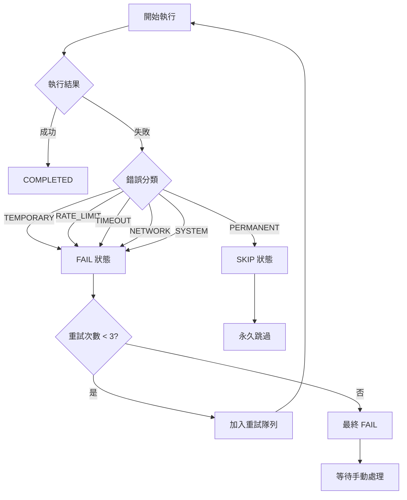
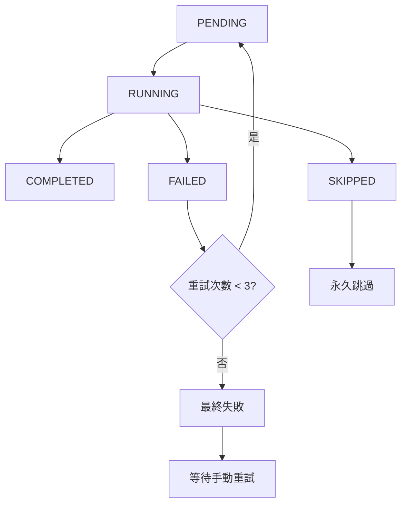

# Batch Crawler 重試機制完整指南

**版本**: v3.1.2  
**更新日期**: 2025-08-17  
**作者**: Claude Code Assistant

## 📋 目錄

- [系統概述](#系統概述)
- [Skip vs Fail 任務狀態詳解](#skip-vs-fail-任務狀態詳解)
- [三層記錄系統架構](#三層記錄系統架構)
- [重試策略與錯誤分類](#重試策略與錯誤分類)
- [跳過任務重試功能](#跳過任務重試功能)
- [進度追蹤系統](#進度追蹤系統)
- [重試命令參考](#重試命令參考)
- [與 Pipeline 重試的區別](#與-pipeline-重試的區別)
- [實戰案例](#實戰案例)
- [故障排除](#故障排除)

## 🚀 系統概述

Batch Crawler 重試機制是一個智慧的錯誤恢復系統，它能夠：

- **自動分類錯誤**：區分暫時性錯誤（可重試）和永久性錯誤（直接跳過）
- **智慧重試策略**：指數退避延遲，避免過度重試
- **完整進度追蹤**：記錄每個配置的執行狀態和重試歷史
- **斷點續傳**：支援中斷後恢復執行
- **手動重試控制**：超過重試次數後，提供手動重試選項

### 核心理念

```
自動重試 (最多3次) → 標記失敗 → 記錄進度 → 手動重試指令
```

這確保了：
1. 不會無限重試造成資源浪費
2. 失敗項目不會遺失，可手動重新處理
3. 重試過程完全可控和可追蹤

## 🏗️ 三層記錄系統架構

### 架構圖

```
BatchCrawlerManager (批量管理層)
├── ProgressTracker (進度追蹤層)
│   ├── 批次ID生成與管理
│   ├── 任務狀態追蹤
│   └── 進度檔案持久化
├── ErrorRecovery (錯誤恢復層)  
│   ├── 錯誤分類與處理
│   ├── 重試策略計算
│   └── 錯誤日誌記錄
└── SiteConcurrencyManager (並發控制層)
    ├── 網站特定並發控制
    ├── 任務隊列管理
    └── 統計信息收集
```

### 第一層：BatchCrawlerManager

**職責**: 批量任務的總體協調和管理

```typescript
interface BatchResult {
  success: boolean;
  total: number;
  completed: number;
  failed: number;
  skipped: number;
  duration: number;
  errors: string[];
  progressId: string;      // 批次執行ID
  outputFiles: string[];   // 輸出檔案列表
}
```

**核心功能**:
- 批次任務分發和執行
- 與 ProgressTracker 和 ErrorRecovery 的協調
- 提供統一的批次管理API

### 第二層：ProgressTracker

**職責**: 詳細的進度追蹤和狀態管理

```typescript
enum TaskStatus {
  PENDING = 'pending',      // 待執行
  RUNNING = 'running',      // 執行中
  COMPLETED = 'completed',  // 已完成
  FAILED = 'failed',        // 失敗 (可重試)
  SKIPPED = 'skipped'       // 跳過 (不重試)
}

interface ProgressState {
  id: string;               // 批次ID
  total: number;
  completed: number;
  failed: number;
  skipped: number;
  percentage: number;
  startTime: number;
  lastUpdated: number;
  tasks: Map<string, TaskInfo>;  // 配置名稱 → 任務信息
}
```

**檔案位置**: `.progress/batch_YYYYMMDD_HHMMSS.json`

### 第三層：ErrorRecovery

**職責**: 錯誤分類、重試策略和錯誤日誌

```typescript
enum ErrorType {
  TEMPORARY = 'temporary',    // 暫時性錯誤 (網路超時等)
  PERMANENT = 'permanent',    // 永久性錯誤 (404, 配置錯誤等)
  SYSTEM = 'system',         // 系統錯誤 (記憶體不足等)
  RATE_LIMIT = 'rate_limit', // 速率限制
  TIMEOUT = 'timeout',       // 超時
  NETWORK = 'network'        // 網路問題
}

enum ErrorAction {
  RETRY = 'retry',                    // 立即重試
  RETRY_AFTER_DELAY = 'retry_after_delay',  // 延遲重試
  SKIP = 'skip',                      // 跳過此項目
  ABORT = 'abort',                    // 中止整個批次
  REDUCE_CONCURRENCY = 'reduce_concurrency' // 降低併發數
}
```

## 🔍 Skip vs Fail 任務狀態詳解

### 狀態概念說明

Batch Crawler 系統使用兩種不同的失敗狀態來區分錯誤的嚴重程度和可恢復性：

#### SKIP 狀態 (跳過)
- **定義**: 永久性錯誤，傳統上不會重試
- **觸發條件**: 404 錯誤、配置錯誤、權限問題等
- **ErrorType**: `PERMANENT`
- **ErrorAction**: `SKIP`
- **傳統行為**: 不加入重試隊列，直接標記為永久失敗

#### FAIL 狀態 (失敗)
- **定義**: 暫時性錯誤，可以重試恢復
- **觸發條件**: 網路超時、連接重置、暫時性伺服器錯誤等
- **ErrorType**: `TEMPORARY`, `RATE_LIMIT`, `TIMEOUT`, `NETWORK`
- **ErrorAction**: `RETRY`, `RETRY_AFTER_DELAY`
- **系統行為**: 自動加入重試隊列，最多重試 3 次

### 狀態轉換流程



### 實際案例分析

#### 案例 1: 404 錯誤 (SKIP)
```bash
[ERROR] 任務執行異常: 404: Page not found
[INFO] 錯誤類型: PERMANENT, 行動: SKIP
[INFO] 配置失敗: quarterly/tw/eps/yahoo-finance-tw-eps-2330_TW - 404: Page not found
# 結果: 任務狀態 = SKIPPED，不會自動重試
```

#### 案例 2: 網路超時 (FAIL)
```bash
[ERROR] 任務執行異常: timeout: Navigation timeout exceeded
[INFO] 錯誤類型: TIMEOUT, 行動: RETRY_AFTER_DELAY
[INFO] 將在 10 秒後重試: quarterly/tw/eps/yahoo-finance-tw-eps-2330_TW (嘗試 2/3)
# 結果: 任務狀態 = FAILED，會自動重試
```

#### 案例 3: 速率限制 (FAIL)
```bash
[ERROR] 任務執行異常: 429: Too Many Requests
[INFO] 錯誤類型: RATE_LIMIT, 行動: RETRY_AFTER_DELAY
[INFO] 將在 30 秒後重試: quarterly/tw/eps/yahoo-finance-tw-eps-2330_TW (嘗試 1/2)
# 結果: 任務狀態 = FAILED，會延遲重試
```

### 為什麼需要區分 SKIP 和 FAIL？

1. **避免無效重試**: SKIP 狀態避免對永久性錯誤進行無意義的重試
2. **資源最佳化**: 將重試資源集中在可恢復的錯誤上
3. **清晰的錯誤分類**: 幫助開發者快速識別問題類型
4. **智慧恢復策略**: 不同錯誤類型採用不同的恢復策略

## 🔄 跳過任務重試功能

### 功能概述

v3.1.2 版本新增了強制重試 SKIP 任務的功能，突破傳統設計限制：

- **突破限制**: 允許重試原本被標記為 SKIP 的任務
- **靈活控制**: 支援只重試 SKIP 任務或同時重試 FAIL + SKIP
- **重置選項**: 可選擇是否重置重試計數器
- **安全機制**: 提供預覽模式和確認機制

### 核心方法擴展

#### ProgressTracker 新增方法

```typescript
// 獲取跳過的任務列表
getSkippedConfigs(): string[]

// 獲取可重試的任務（包含跳過任務）
getRetryableConfigsIncludeSkipped(): string[]

// 獲取所有失敗和跳過的任務
getAllFailedAndSkippedConfigs(): string[]

// 重置指定任務的狀態
resetConfigs(configNames: string[], options: {
  resetAttempts?: boolean
}): number

// 重置跳過的任務
resetSkippedTasks(resetAttempts: boolean = false): number

// 重置所有失敗和跳過的任務
resetAllFailedAndSkippedTasks(resetAttempts: boolean = false): number
```

#### BatchCrawlerManager 新增方法

```typescript
// 全面重試方法，支援跳過任務
async retryAll(progressId: string, options: BatchOptions & {
  includeSkipped?: boolean;     // 是否包含跳過的任務
  resetAttempts?: boolean;      // 是否重置重試計數器
  skippedOnly?: boolean;        // 只重試跳過的任務
} = {}): Promise<BatchResult>
```

### 命令行選項擴展

#### 新增 CLI 參數

```bash
# 重試所有失敗和跳過的任務
npx tsx src/cli.ts crawl-batch --retry-all=batch_20250817_120000

# 只重試跳過的任務
npx tsx src/cli.ts crawl-batch --retry-skipped-only=batch_20250817_120000

# 強制重試（即使重試次數 > 3）
npx tsx src/cli.ts crawl-batch --retry-failed=batch_20250817_120000 --force-retry

# 重置重試計數器
npx tsx src/cli.ts crawl-batch --retry-all=batch_20250817_120000 --reset-attempts
```

### 使用範例

#### 範例 1: 重試所有跳過的任務

```bash
# 1. 查看當前狀態
npm run crawl:status
# 輸出: 成功 1200/1500, 失敗 150, 跳過 150

# 2. 預覽要重置的跳過任務
tsx scripts/reset-progress-status.ts \
  --progress-id=batch-quarterly-us-all-20250817T062052 \
  --type=skipped \
  --dry-run

# 3. 重置跳過任務狀態
tsx scripts/reset-progress-status.ts \
  --progress-id=batch-quarterly-us-all-20250817T062052 \
  --type=skipped \
  --force

# 4. 重新執行重置的任務
npx tsx src/cli.ts crawl-batch --resume=batch-quarterly-us-all-20250817T062052
```

#### 範例 2: 一步到位重試跳過任務

```bash
# 直接重試跳過任務（自動重置 + 重新執行）
npx tsx src/cli.ts crawl-batch \
  --retry-skipped-only=batch-quarterly-us-all-20250817T062052 \
  --reset-attempts
```

#### 範例 3: 重試所有失敗類型

```bash
# 重試失敗和跳過的所有任務
npx tsx src/cli.ts crawl-batch \
  --retry-all=batch-quarterly-us-all-20250817T062052 \
  --force-retry \
  --reset-attempts
```

### 進度重置腳本詳解

#### 腳本功能

`scripts/reset-progress-status.ts` 提供完整的進度重置功能：

```bash
# 查看所有進度檔案狀態
tsx scripts/reset-progress-status.ts --list-all

# 重置類型選項
--type=failed                # 只重置失敗任務
--type=skipped               # 只重置跳過任務  
--type=failed-and-skipped    # 重置失敗和跳過任務 (預設)
--type=all                   # 重置所有未完成任務

# 其他選項
--reset-attempts             # 重置重試計數器
--dry-run                   # 預覽模式
--force                     # 跳過確認提示
```

#### 重置報告範例

```bash
📊 進度重置報告
============================================================
📋 進度ID: batch-quarterly-us-all-20250817T062052
🔄 重置類型: skipped
📈 重置任務數: 150/1500
🔢 重置重試計數: 是

📊 狀態變化:
   重置前: 完成 1200, 失敗 150, 跳過 150, 待處理 0, 執行中 0
   重置後: 完成 1200, 失敗 150, 跳過 0, 待處理 150, 執行中 0

💡 下一步建議:
   🚀 重新執行: npx tsx src/cli.ts crawl-batch --resume=batch-quarterly-us-all-20250817T062052
   📊 查看狀態: npx tsx src/cli.ts crawl-batch --status
```

### 使用場景與最佳實踐

#### 適用場景

1. **網站結構變化**: 原本 404 的頁面恢復正常
2. **權限問題解決**: 暫時的存取限制已解除
3. **配置修復**: 修復配置錯誤後需要重新嘗試
4. **大量跳過任務**: 需要批量重新評估跳過的任務

#### 最佳實踐

```bash
# 1. 先用預覽模式查看影響範圍
tsx scripts/reset-progress-status.ts \
  --progress-id=YOUR_BATCH_ID \
  --type=skipped \
  --dry-run

# 2. 小批量測試重試
npx tsx src/cli.ts crawl-batch \
  --retry-skipped-only=YOUR_BATCH_ID \
  --limit=10

# 3. 確認沒問題後全量重試
npx tsx src/cli.ts crawl-batch \
  --retry-skipped-only=YOUR_BATCH_ID \
  --reset-attempts
```

#### 注意事項

⚠️ **重要提醒**:
- 重置 SKIP 任務會將其狀態改為 PENDING，重新加入執行隊列
- 使用 `--reset-attempts` 會清零重試計數器，任務會重新開始 3 次重試週期
- 大量重置可能會增加網站負載，建議分批處理
- 永久性錯誤（如真實的 404）重試後可能再次失敗

## 🔄 重試策略與錯誤分類

### 錯誤分類邏輯

#### 1. 暫時性錯誤 (TEMPORARY)
**可重試，最多3次**

```javascript
// 判斷條件
message.includes('timeout') ||
message.includes('connection reset') ||
message.includes('connection refused') ||
message.includes('socket hang up') ||
message.includes('network error') ||
message.includes('econnreset') ||
message.includes('enotfound') ||
message.includes('etimedout')
```

#### 2. 速率限制錯誤 (RATE_LIMIT)
**可重試，最多2次，延遲30秒**

```javascript
// 判斷條件
message.includes('429') ||
message.includes('too many requests') ||
message.includes('rate limit') ||
message.includes('quota exceeded') ||
message.includes('throttle')
```

#### 3. 永久性錯誤 (PERMANENT)
**不重試，直接跳過**

```javascript
// 判斷條件
message.includes('404') ||
message.includes('not found') ||
message.includes('invalid configuration') ||
message.includes('parse error') ||
message.includes('malformed') ||
message.includes('unauthorized') ||
message.includes('403') ||
message.includes('access denied')
```

#### 4. 系統錯誤 (SYSTEM)
**可重試1次，延遲60秒**

```javascript
// 判斷條件
message.includes('out of memory') ||
message.includes('enospc') ||
message.includes('enomem') ||
message.includes('system error') ||
message.includes('internal server error') ||
message.includes('500')
```

### 重試延遲計算

#### 指數退避 + 隨機抖動

```typescript
calculateRetryDelay(attempt: number, errorType?: ErrorType): number {
  // 基於錯誤類型的基礎延遲
  let baseDelay = 5000; // 預設5秒
  
  switch (errorType) {
    case ErrorType.RATE_LIMIT:
      baseDelay = 30000; // 速率限制延遲30秒
      break;
    case ErrorType.TIMEOUT:
      baseDelay = 10000; // 超時延遲10秒
      break;
    case ErrorType.NETWORK:
      baseDelay = 15000; // 網路錯誤延遲15秒
      break;
    case ErrorType.SYSTEM:
      baseDelay = 60000; // 系統錯誤延遲1分鐘
      break;
  }

  // 指數退避：每次重試延遲翻倍
  const exponentialDelay = baseDelay * Math.pow(2, attempt - 1);
  
  // 加入隨機抖動 (±25%)
  const jitter = exponentialDelay * 0.25 * (Math.random() * 2 - 1);
  const finalDelay = Math.max(1000, exponentialDelay + jitter);
  
  // 限制最大延遲時間
  return Math.min(finalDelay, 300000); // 最多5分鐘
}
```

#### 重試延遲範例

| 嘗試次數 | 暫時性錯誤 | 速率限制 | 系統錯誤 |
|----------|------------|----------|----------|
| **第1次** | 5 秒 | 30 秒 | 60 秒 |
| **第2次** | 10 秒 | 60 秒 | - |
| **第3次** | 20 秒 | - | - |

## 📊 進度追蹤系統

### .progress 目錄結構

```
.progress/
├── batch_20250816_140530.json    # 2025-08-16 14:05:30 執行批次
├── batch_20250816_151245.json    # 2025-08-16 15:12:45 執行批次
├── batch_20250816_162010.json    # 2025-08-16 16:20:10 執行批次
└── ...
```

### 批次ID生成規則

```typescript
generateProgressId(): string {
  const now = new Date();
  const year = now.getFullYear();
  const month = String(now.getMonth() + 1).padStart(2, '0');
  const day = String(now.getDate()).padStart(2, '0');
  const hour = String(now.getHours()).padStart(2, '0');
  const minute = String(now.getMinutes()).padStart(2, '0');
  const second = String(now.getSeconds()).padStart(2, '0');
  
  return `batch_${year}${month}${day}_${hour}${minute}${second}`;
}
```

### 進度檔案格式

```json
{
  "id": "batch_20250816_140530",
  "category": "quarterly",
  "market": "tw",
  "type": null,
  "total": 150,
  "completed": 120,
  "failed": 25,
  "skipped": 5,
  "percentage": 80.0,
  "startTime": 1692187530000,
  "lastUpdated": 1692189330000,
  "tasks": {
    "quarterly/tw/eps/yahoo-finance-tw-eps-2330_TW": {
      "status": "completed",
      "attempts": 1,
      "lastError": null,
      "startTime": 1692187530000,
      "endTime": 1692187535000,
      "outputPath": "output/quarterly/tw/eps/yahoo-finance-tw-eps-2330_TW.json"
    },
    "quarterly/tw/eps/yahoo-finance-tw-eps-2454_TW": {
      "status": "failed",
      "attempts": 3,
      "lastError": "timeout: Navigation timeout exceeded",
      "startTime": 1692187540000,
      "endTime": 1692187580000,
      "outputPath": null
    },
    "quarterly/tw/eps/yahoo-finance-tw-eps-1101_TW": {
      "status": "skipped",
      "attempts": 1,
      "lastError": "404: Page not found",
      "startTime": 1692187545000,
      "endTime": 1692187550000,
      "outputPath": null
    }
  }
}
```

### 任務狀態轉換



## 📝 重試命令參考

### 基礎狀態查詢

```bash
# 查看當前執行狀態
npm run crawl:retry:status

# 輸出範例：
# 📊 批次執行狀態
# ==================
# 當前批次: batch_20250816_140530
# 總任務數: 150
# 已完成: 120 (80.0%)
# 失敗: 25 (16.7%)  
# 跳過: 5 (3.3%)
```

### 傳統重試命令 (只重試 FAIL 任務)

```bash
# 重試所有失敗的任務
npm run crawl:retry:failed

# 按區域重試
npm run crawl:retry:tw         # 只重試台灣市場失敗任務
npm run crawl:retry:us         # 只重試美國市場失敗任務
npm run crawl:retry:jp         # 只重試日本市場失敗任務

# 批次重試所有區域
npm run crawl:retry:all        # 重試所有區域的失敗任務
```

### ⭐ v3.1.2 新增：跳過任務重試命令

#### 快速重試命令（推薦）

```bash
# 只重試跳過的任務
npm run crawl:retry:skipped-only

# 重試所有失敗和跳過的任務
npm run crawl:retry:all-tasks

# 查看重置腳本幫助
npm run crawl:reset:help
```

#### 進階重試命令

```bash
# 直接重試跳過任務（一步到位）
npx tsx src/cli.ts crawl-batch --retry-skipped-only=PROGRESS_ID --reset-attempts

# 重試所有失敗和跳過任務
npx tsx src/cli.ts crawl-batch --retry-all=PROGRESS_ID --force-retry

# 強制重試（即使重試次數 > 3）
npx tsx src/cli.ts crawl-batch --retry-failed=PROGRESS_ID --force-retry --reset-attempts
```

#### 進度重置命令

```bash
# 預覽重置跳過任務
tsx scripts/reset-progress-status.ts --progress-id=PROGRESS_ID --type=skipped --dry-run

# 重置跳過任務狀態
tsx scripts/reset-progress-status.ts --progress-id=PROGRESS_ID --type=skipped --reset-attempts --force

# 重置所有失敗和跳過任務
tsx scripts/reset-progress-status.ts --progress-id=PROGRESS_ID --type=failed-and-skipped --force

# 列出所有進度檔案
tsx scripts/reset-progress-status.ts --list-all
```

### 重試模式選擇

```bash
# 使用 site-based concurrency 重試
npm run crawl:retry:site

# 使用傳統全域並發重試
npm run crawl:retry:global
```

### 進階重試操作

```bash
# 恢復特定批次執行
npx tsx src/cli.ts crawl-batch --resume=batch_20250816_140530

# 只重試特定批次的失敗項目
npx tsx src/cli.ts crawl-batch --retry-failed=batch_20250816_140530

# 生成錯誤報告
npm run crawl:retry:report
```

### 自定義重試參數

```bash
# 調整重試次數
npx tsx src/cli.ts crawl-batch --retry-attempts=5 --market=tw

# 調整並發和延遲
npx tsx src/cli.ts crawl-batch --retry-failed --concurrent=1 --delay=10000

# 只重試特定類型錯誤 (規劃中)
npx tsx src/cli.ts crawl-batch --retry-failed --error-types=timeout,network
```

### 常用組合命令

#### 處理大量跳過任務的完整流程

```bash
# 1. 查看所有進度檔案狀態
tsx scripts/reset-progress-status.ts --list-all

# 2. 查看特定進度的詳細狀態
npm run crawl:status

# 3. 預覽重置跳過任務的影響
tsx scripts/reset-progress-status.ts --progress-id=YOUR_PROGRESS_ID --type=skipped --dry-run

# 4. 小批量測試重試
npx tsx src/cli.ts crawl-batch --retry-skipped-only=YOUR_PROGRESS_ID --limit=10

# 5. 確認無問題後，全量重試
npx tsx src/cli.ts crawl-batch --retry-skipped-only=YOUR_PROGRESS_ID --reset-attempts
```

#### 一步到位重試所有失敗類型

```bash
# 適用於需要重新處理所有失敗項目的場景
npx tsx src/cli.ts crawl-batch --retry-all=YOUR_PROGRESS_ID --force-retry --reset-attempts
```

## 🔄 與 Pipeline 重試的區別

### 系統層級對比

| 特性 | Batch Crawler 重試 | Pipeline 重試 |
|------|------------------|---------------|
| **範圍** | 單次批量爬取任務 | 整個 Pipeline 流程 |
| **記錄檔案** | `.progress/batch_*.json` | `output/pipeline-retries.json` |
| **重試觸發** | 自動 + 手動 | 自動 + 手動 |
| **重試粒度** | 個別配置檔案 | Pipeline 步驟 |
| **適用場景** | 爬取執行失敗 | Pipeline 步驟失敗 |

### 使用場景區分

#### Batch Crawler 重試
```bash
# 適用場景：爬取過程中的失敗
- 網路連線問題導致爬取失敗
- 特定配置檔案執行異常
- 網站暫時無法訪問
- 併發限制導致的超時

# 典型使用
npm run crawl:retry:failed
```

#### Pipeline 重試  
```bash
# 適用場景：Pipeline 流程的失敗
- 自動配置生成失敗
- 數據匯入 API 調用失敗
- 標籤同步處理失敗
- 整體 Pipeline 中斷

# 典型使用
npm run pipeline:retry
```

### 並行使用策略

```bash
# 完整的錯誤恢復流程
1. 執行 Pipeline: npm run pipeline:all
2. 如果 Pipeline 失敗: npm run pipeline:retry
3. 如果爬取部分失敗: npm run crawl:retry:failed
4. 查看最終狀態: npm run crawl:retry:status
```

## 🎯 實戰案例

### 案例1：網路不穩定環境

**情境**: 在網路不穩定的環境中執行批量爬取

```bash
# 1. 開始批量爬取
npm run crawl:tw:quarterly

# 2. 執行過程中出現多個網路錯誤
# 系統自動重試暫時性錯誤，超過3次後標記失敗

# 3. 查看執行結果
npm run crawl:retry:status
# 輸出: 成功 120/150, 失敗 25, 跳過 5

# 4. 分析失敗原因
npm run crawl:retry:report
# 顯示: 大部分為 TIMEOUT 和 NETWORK 錯誤

# 5. 網路恢復後，重試失敗任務
npm run crawl:retry:tw

# 6. 確認最終結果
npm run crawl:retry:status
# 輸出: 成功 142/150, 失敗 3, 跳過 5
```

### 案例2：速率限制處理

**情境**: 遇到網站速率限制

```bash
# 1. 執行高並發爬取
npm run crawl:site:high-concurrency

# 2. 觸發速率限制
# 系統自動延遲30秒重試，最多2次

# 3. 部分任務仍然失敗
npm run crawl:retry:status
# 顯示一些 RATE_LIMIT 錯誤

# 4. 使用較低並發重試
npm run crawl:retry:global
# 或者手動設定
npx tsx src/cli.ts crawl-batch --retry-failed --concurrent=1 --delay=10000

# 5. 驗證成功率提升
npm run crawl:retry:status
```

### 案例3：批次中斷恢復

**情境**: 批量爬取過程中系統中斷

```bash
# 1. 執行大型批量爬取
npm run crawl:quarterly

# 2. 系統意外中斷 (停電、強制關閉等)
# 進度自動保存到 .progress/batch_*.json

# 3. 系統恢復後，查看可恢復的批次
ls .progress/

# 4. 恢復中斷的批次
npx tsx src/cli.ts crawl-batch --resume=batch_20250816_140530

# 5. 系統自動繼續執行未完成的任務
# 跳過已完成的任務，重新執行PENDING和FAILED任務
```

### 案例4：錯誤分類處理

**情境**: 混合錯誤類型的處理

```bash
# 1. 執行爬取後檢查錯誤分類
npm run crawl:retry:report

# 輸出範例:
# 📊 錯誤統計
# =============
# TIMEOUT: 15 個 (網路超時)
# RATE_LIMIT: 8 個 (速率限制)  
# PERMANENT: 2 個 (404錯誤)
# SYSTEM: 0 個

# 2. 針對不同錯誤類型採取措施
# TIMEOUT 和 RATE_LIMIT 可重試
npm run crawl:retry:failed

# PERMANENT 錯誤需要檢查配置
# 查看具體失敗的配置檔案
npx tsx src/cli.ts crawl-batch --status | grep "404"
```

## 🔧 故障排除

### 常見問題

#### 1. 進度檔案損壞

**症狀**: 無法恢復執行，出現JSON解析錯誤

```bash
# 檢查進度檔案
cat .progress/batch_20250816_140530.json

# 如果檔案損壞，手動清理並重新執行
rm .progress/batch_20250816_140530.json
npm run crawl:tw:quarterly
```

#### 2. 重試命令無效果

**症狀**: 執行重試命令但沒有重新執行任務

```bash
# 檢查是否有可重試的失敗任務
npm run crawl:retry:status

# 如果沒有失敗任務，說明：
# 1. 所有任務都已完成
# 2. 失敗任務都被標記為SKIPPED (永久錯誤)
# 3. 進度檔案找不到

# 強制重新執行所有任務
npm run crawl:tw:quarterly
```

#### 3. 重試次數過多

**症狀**: 同一個配置反覆重試但一直失敗

```bash
# 檢查具體錯誤訊息
npm run crawl:retry:report

# 如果是永久性錯誤但被誤分類為暫時性錯誤：
# 1. 檢查配置檔案是否正確
# 2. 檢查URL是否有效
# 3. 手動執行單一配置測試

npx tsx src/cli.ts --config config-categorized/quarterly/tw/eps/yahoo-finance-tw-eps-2330_TW.json
```

### 日誌分析

#### 正常重試日誌

```
[INFO] 開始執行: quarterly/tw/eps/yahoo-finance-tw-eps-2330_TW (嘗試 1)
[ERROR] 任務執行異常: timeout: Navigation timeout exceeded
[INFO] 將在 10 秒後重試: quarterly/tw/eps/yahoo-finance-tw-eps-2330_TW
[INFO] 開始執行: quarterly/tw/eps/yahoo-finance-tw-eps-2330_TW (嘗試 2)
[INFO] 完成: quarterly/tw/eps/yahoo-finance-tw-eps-2330_TW
```

#### 異常重試日誌

```
[ERROR] 任務執行異常: 404: Page not found
[INFO] 錯誤類型: PERMANENT, 行動: SKIP
[INFO] 配置失敗: quarterly/tw/eps/yahoo-finance-tw-eps-2330_TW - 404: Page not found
```

### 調試技巧

#### 1. 單一配置測試

```bash
# 測試特定失敗配置
npx tsx src/cli.ts --config config-categorized/quarterly/tw/eps/yahoo-finance-tw-eps-2330_TW.json --verbose

# 使用除錯模式
npx tsx src/cli.ts --config config-categorized/quarterly/tw/eps/yahoo-finance-tw-eps-2330_TW.json --debug-selectors
```

#### 2. 重試邏輯測試

```bash
# 使用最低並發測試重試
npx tsx src/cli.ts crawl-batch --retry-failed --concurrent=1 --verbose

# 強制延長延遲測試穩定性
npx tsx src/cli.ts crawl-batch --retry-failed --delay=15000
```

#### 3. 進度檔案分析

```bash
# 查看進度檔案詳情
cat .progress/batch_20250816_140530.json | jq '.tasks | to_entries | map(select(.value.status == "failed"))'

# 統計錯誤類型
cat .progress/batch_20250816_140530.json | jq '.tasks | to_entries | map(.value.lastError) | group_by(.) | map({error: .[0], count: length})'
```

## 📈 最佳實踐

### 1. 預防性措施

```bash
# 使用穩定性配置
npm run crawl:site:stability

# 分批執行大型任務
npm run crawl:tw:quarterly -- --limit=50
```

### 2. 監控和維護

```bash
# 定期清理舊進度檔案
find .progress -name "batch_*.json" -mtime +7 -delete

# 定期檢查重試統計
npm run crawl:retry:report
```

### 3. 自動化恢復

```bash
# 創建自動恢復腳本
#!/bin/bash
echo "檢查是否有失敗任務需要重試..."
FAILED_COUNT=$(npm run crawl:retry:status 2>/dev/null | grep "失敗:" | grep -o '[0-9]\+' | head -1)

if [ "$FAILED_COUNT" -gt 0 ]; then
    echo "發現 $FAILED_COUNT 個失敗任務，開始重試..."
    npm run crawl:retry:failed
else
    echo "沒有失敗任務需要重試"
fi
```

## 🔮 未來發展

### v3.2 規劃功能

1. **智慧重試策略**: 基於歷史數據調整重試參數
2. **錯誤模式識別**: 自動識別常見錯誤模式並調整策略
3. **批次優先級**: 支援批次任務優先級管理
4. **分佈式重試**: 跨機器的重試任務分配

### v3.3+ 長期規劃

1. **機器學習優化**: 預測失敗任務並提前調整策略
2. **自動配置修復**: 自動檢測和修復配置問題
3. **即時監控面板**: Web UI 顯示重試狀態和統計
4. **集成告警**: 重試失敗時自動發送通知

---

**版本歷史**:
- v3.1.2 (2025-08-17): **跳過任務重試功能增強**
  - 新增強制重試 SKIP 任務的能力，突破傳統設計限制
  - 擴展 ProgressTracker 和 BatchCrawlerManager 支援跳過任務處理
  - 新增 reset-progress-status.ts 腳本，提供完整進度重置功能
  - 新增 CLI 參數：--retry-all, --retry-skipped-only, --force-retry, --reset-attempts
  - 詳細的 Skip vs Fail 狀態說明和使用場景指南
  - 完整的命令參考和最佳實踐文檔
- v3.1.1 (2025-08-16): Site-based Concurrency 智慧並發控制
- v3.1.0 (2025-08-14): 基礎重試功能實現
- v3.0.0 (2025-08-14): 批量爬取系統建立

**作者**: Claude Code Assistant  
**更新**: 隨系統版本持續更新