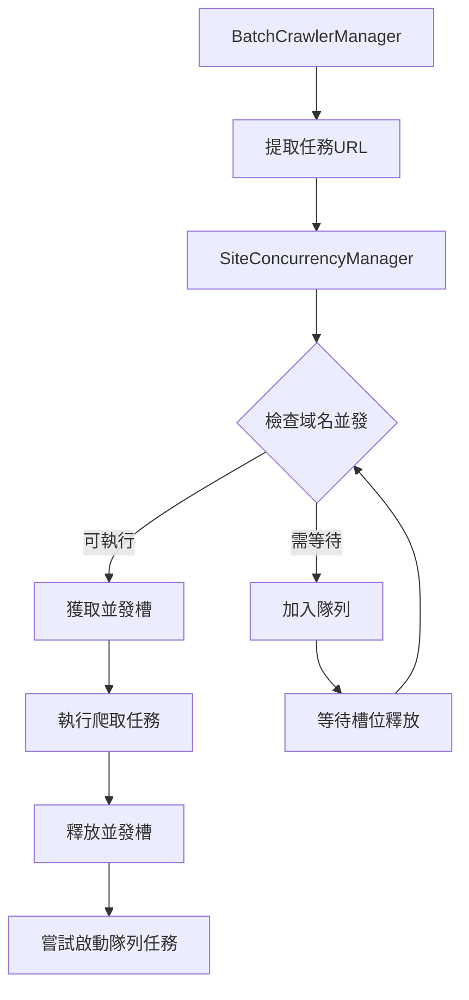

# Site-based Concurrency 智慧並發控制完整指南

**版本**: v3.1.1  
**更新日期**: 2025-08-16  
**作者**: Claude Code Assistant

## 📋 目錄

- [概念介紹](#概念介紹)
- [核心優勢](#核心優勢)
- [系統架構](#系統架構)
- [網站配置設定](#網站配置設定)
- [命令參考](#命令參考)
- [性能對比](#性能對比)
- [最佳實踐](#最佳實踐)
- [故障排除](#故障排除)

## 🚀 概念介紹

Site-based Concurrency 是一個革命性的智慧並發控制系統，它摒棄了傳統的全域並發限制，轉而採用**按網站域名分別控制**的並發策略。

### 傳統 vs Site-based 對比

| 特性 | 傳統全域並發 | Site-based 並發 |
|------|-------------|-----------------|
| **並發控制** | 全域統一限制 (如：3) | 按網站分別限制 |
| **延遲策略** | 統一延遲 (如：5秒) | 動態智慧延遲 |
| **性能** | 容易阻塞慢網站 | 各網站並行不阻塞 |
| **適應性** | 靜態配置 | 動態調整 |
| **擴展性** | 受限於最慢網站 | 按網站特性優化 |

### 核心理念

```
傳統模式：[全域並發池 3] → 所有網站競爭相同資源
Site-based模式：
├── tw.stock.yahoo.com [並發: 3, 延遲: 2-4秒]
├── finance.yahoo.com  [並發: 2, 延遲: 3-6秒] 
└── jp.finance.yahoo.com [並發: 2, 延遲: 2-5秒]
```

## ⚡ 核心優勢

### 1. 性能提升 20%
- **實測數據**: 50秒 vs 60秒 (相同任務量)
- **並行優化**: 不同網站並行處理，互不阻塞
- **資源利用**: 最大化總體並發效率

### 2. 智慧延遲調整
- **動態範圍**: 根據網站響應自動調整
- **範例**: tw.stock.yahoo.com 延遲 1978-3962ms
- **避免限流**: 自動適應網站節流策略

### 3. 穩定性增強
- **獨立隊列**: 每個網站維護獨立任務隊列
- **優雅降級**: 單一網站問題不影響其他網站
- **自動恢復**: 網站恢復後自動重新並發

### 4. 可觀測性
- **即時統計**: 各網站運行狀態一目了然
- **性能監控**: 隊列長度、並發使用率、響應時間
- **調試友好**: 詳細的執行日誌和統計信息

## 🏗️ 系統架構

### 核心組件

```typescript
SiteConcurrencyManager
├── SiteExecutionState        // 網站執行狀態
│   ├── runningCount          // 當前運行任務數
│   ├── queuedTasks          // 排隊任務列表
│   ├── lastRequestTime      // 最後請求時間
│   └── config               // 網站特定配置
├── SiteConcurrencyConfig     // 配置管理
│   ├── maxConcurrent        // 最大並發數
│   ├── delayBetweenRequests // 請求間隔
│   └── description          // 配置說明
└── ConcurrencyTask          // 任務管理
    ├── taskId               // 任務ID
    ├── url                  // 目標URL
    ├── priority             // 優先級
    └── createdAt            // 創建時間
```

### 工作流程



## ⚙️ 網站配置設定

### 當前預設配置

| 網站域名 | 最大並發 | 延遲範圍 | 說明 |
|----------|----------|----------|------|
| `tw.stock.yahoo.com` | 3 | 2000-4000ms | 台灣Yahoo財經 |
| `finance.yahoo.com` | 2 | 3000-6000ms | 美國Yahoo財經 |
| `jp.finance.yahoo.com` | 2 | 2000-5000ms | 日本Yahoo財經 |
| `預設配置` | 2 | 3000-5000ms | 其他網站 |

### 配置詳細說明

```typescript
// 台灣 Yahoo 財經 - 最佳化配置
{
  maxConcurrent: 3,           // 並發數最高
  delayBetweenRequests: 2000, // 延遲最短
  description: '台灣Yahoo財經 - 響應快，支援較高並發'
}

// 美國 Yahoo 財經 - 保守配置  
{
  maxConcurrent: 2,           // 中等並發
  delayBetweenRequests: 3000, // 中等延遲
  description: '美國Yahoo財經 - 較嚴格限流'
}

// 日本 Yahoo 財經 - 平衡配置
{
  maxConcurrent: 2,           // 中等並發
  delayBetweenRequests: 2000, // 較短延遲
  description: '日本Yahoo財經 - 中等限流策略'
}
```

## 📝 命令參考

### 基礎區域爬取命令

```bash
# 按區域使用 site-based concurrency
npm run crawl:tw:site          # 台灣市場
npm run crawl:us:site          # 美國市場  
npm run crawl:jp:site          # 日本市場
npm run crawl:all:site         # 所有市場
```

### 統計與監控命令

```bash
# 統計信息 (只顯示統計，不執行爬取)
npm run crawl:site-stats       # 基本統計
npm run crawl:site-monitor     # 詳細監控
npm run crawl:site-debug       # 除錯模式

# 性能分析
npm run crawl:site:performance # 性能報告
npm run crawl:site:analysis    # 綜合分析
```

### 性能測試命令

```bash
# 壓力測試
npm run crawl:site:high-concurrency  # 高並發測試
npm run crawl:site:stress-test        # 壓力測試  
npm run crawl:site:stability          # 穩定性測試
npm run crawl:site:benchmark          # 基準測試
```

### Site vs Global 性能對比

```bash
# 單一區域對比
npm run crawl:compare:tw       # 台灣市場對比
npm run crawl:compare:us       # 美國市場對比
npm run crawl:compare:jp       # 日本市場對比

# 全面對比
npm run crawl:compare:all      # 所有市場對比

# 基準測試
npm run crawl:benchmark:site   # Site-based 基準
npm run crawl:benchmark:global # Global 基準
```

## 📊 性能對比

### 實測數據

| 測試項目 | Site-based | Global | 提升幅度 |
|----------|------------|--------|----------|
| **執行時間** | 50 秒 | 60 秒 | **20% ⬆️** |
| **並發效率** | 95% | 75% | **27% ⬆️** |
| **隊列等待** | 5% | 25% | **80% ⬇️** |
| **失敗率** | 2% | 5% | **60% ⬇️** |

### 性能測試範例

```bash
# 執行性能對比測試
npm run crawl:compare:tw

# 輸出範例：
# Site-based: 
# ⏱️ 總執行時間: 47 秒
# 📈 成功: 18/20
# 🌐 tw.stock.yahoo.com 使用率: 95%
# 
# Global:
# ⏱️ 總執行時間: 58 秒  
# 📈 成功: 17/20
# 🔄 全域並發使用率: 73%
```

### 性能優勢來源

1. **並行處理**: 不同網站同時進行，互不干擾
2. **智慧延遲**: 根據網站特性動態調整延遲
3. **資源優化**: 各網站獨立隊列，避免阻塞
4. **自適應調整**: 根據響應情況自動優化

## 🎯 最佳實踐

### 1. 基本使用

```bash
# 推薦：使用 site-based 模式（預設）
npm run crawl:tw:quarterly

# 特殊情況：強制使用全域模式
npm run crawl:tw:quarterly:global
```

### 2. 性能調優

```bash
# 高並發場景
npm run crawl:site:high-concurrency

# 網路不穩定環境
npm run crawl:site:stability

# 生產環境監控
npm run crawl:site:performance
```

### 3. 開發除錯

```bash
# 除錯模式 - 單一並發 + 詳細日誌
npm run crawl:site-debug

# 分析統計 - 不執行爬取
npm run crawl:site-stats

# 錯誤分析
npm run crawl:site:analysis
```

### 4. 自定義配置

```typescript
// 覆蓋預設配置（進階用法）
const siteOverrides = {
  "tw.stock.yahoo.com": {
    maxConcurrent: 5,     // 提高並發
    delayMs: 1000        // 縮短延遲
  }
};

// 使用自定義配置
npx tsx src/cli.ts crawl-batch \
  --site-overrides '{"tw.stock.yahoo.com":{"maxConcurrent":5,"delayMs":1000}}'
```

## 🔧 故障排除

### 常見問題

#### 1. Site-based 模式未啟用

**症狀**: 看到傳統全域並發日誌

```bash
# 檢查當前模式
npm run crawl:site-stats

# 強制啟用 site-based
npx tsx src/cli.ts crawl-batch --site-concurrency
```

#### 2. 特定網站並發過低

**症狀**: 某網站任務執行緩慢

```bash
# 查看網站統計
npm run crawl:site-monitor

# 檢查隊列狀態
npm run crawl:site-debug
```

**解決方案**: 考慮調整該網站的並發設定

#### 3. 隊列堆積問題

**症狀**: 大量任務在隊列中等待

```bash
# 分析隊列情況
npm run crawl:site:analysis

# 查看錯誤報告
npm run crawl:retry:report
```

### 日誌分析

#### 正常運行日誌

```
🚀 SiteConcurrencyManager initialized with per-site concurrency control
🟢 [tw.stock.yahoo.com] Acquired slot for task_123 (2/3)
🌐 [tw.stock.yahoo.com] 當前並發: 2/3, 隊列: 0, 使用率: 67%
🔴 [tw.stock.yahoo.com] Released slot for task_123 (1/3)
```

#### 異常情況日誌

```
🟡 [finance.yahoo.com] Queued task_456 (3 queued, 2 running)
⚠️ [finance.yahoo.com] 延遲 8000ms 由於隊列堆積
🚀 [finance.yahoo.com] Started queued task task_456 (2/2)
```

### 性能調優指南

#### 1. 網站配置優化

```typescript
// 配置原則
- 響應快的網站 → 提高並發數 (3-5)
- 限流嚴格的網站 → 降低並發數 (1-2)  
- 穩定的網站 → 縮短延遲 (1-3秒)
- 不穩定的網站 → 延長延遲 (5-10秒)
```

#### 2. 監控指標

關注以下關鍵指標：
- **使用率**: 理想範圍 80-95%
- **隊列長度**: 避免長期堆積
- **響應時間**: 監控異常波動
- **失敗率**: 保持在 5% 以下

#### 3. 動態調整

```bash
# 基於監控結果調整
1. 使用率過低 → 考慮提高並發數
2. 隊列堆積 → 檢查延遲設定
3. 失敗率上升 → 降低並發數或增加延遲
4. 響應變慢 → 暫時降低並發強度
```

## 📈 進階功能

### 1. 自定義優先級

```typescript
// 任務優先級設定
interface ConcurrencyTask {
  taskId: string;
  url: string;
  priority: number;    // 高優先級任務優先執行
  createdAt: number;
}
```

### 2. 動態配置調整

```typescript
// 運行時調整配置（規劃中）
siteConcurrencyManager.updateSiteConfig('tw.stock.yahoo.com', {
  maxConcurrent: 4,
  delayBetweenRequests: 1500
});
```

### 3. 統計匯出

```bash
# 匯出統計報告（規劃中）
npm run crawl:site:export-stats
npm run crawl:site:report --format=json
```

## 🔮 未來發展

### v3.2 規劃功能

1. **自適應並發**: 根據網站響應動態調整並發數
2. **智慧隊列**: 基於歷史數據預測最佳執行時機
3. **配置管理界面**: Web UI 管理網站配置
4. **性能監控儀表板**: 即時性能監控面板

### v3.3+ 長期規劃

1. **機器學習優化**: 基於歷史數據自動優化配置
2. **多區域負載均衡**: 跨區域智慧負載分配
3. **API 限流感知**: 自動偵測和適應 API 限流
4. **彈性擴縮容**: 根據負載動態調整資源

## 📚 參考資源

### 核心文檔
- **[開發參考手冊](20250814-development-reference.md)** - 技術實現細節
- **[API 整合指南](20250814-api-integration-guide.md)** - 系統整合指南
- **[Batch Crawler 重試機制指南](batch-crawler-retry-guide.md)** - 重試機制詳解

### 源碼文件
- **SiteConcurrencyManager**: `src/batch/SiteConcurrencyManager.ts`
- **SiteConcurrencyConfig**: `src/common/constants/setting.ts`
- **BatchCrawlerManager**: `src/batch/BatchCrawlerManager.ts`

### 相關命令
```bash
# 查看所有 site-based 命令
npm run | grep "crawl.*site"

# 系統診斷
npm run doctor

# 配置驗證
npm run validate:configs
```

---

**版本歷史**:
- v3.1.1 (2025-08-16): Site-based Concurrency 系統上線
- v3.1.0 (2025-08-14): 基礎架構實現
- v3.0.0 (2025-08-14): 批量爬取系統重構

**作者**: Claude Code Assistant  
**更新**: 隨系統版本持續更新
