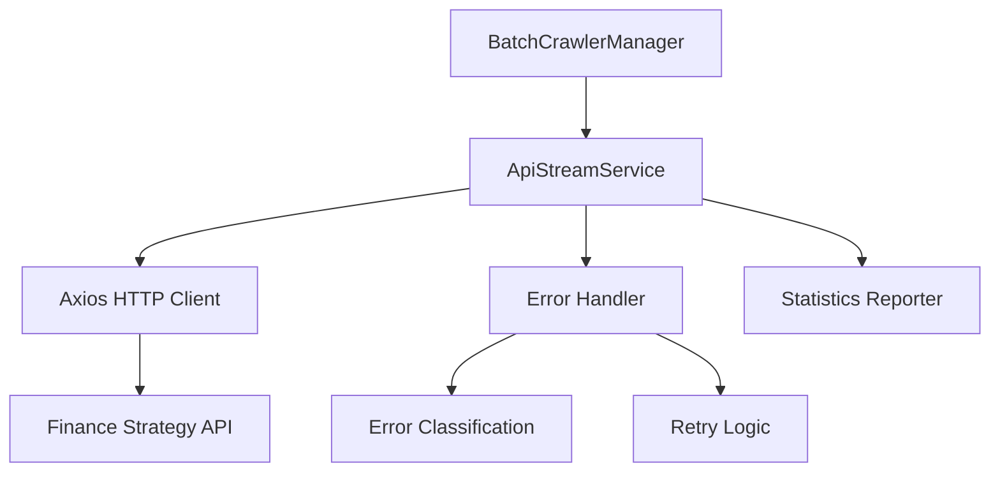

# API 串流服務錯誤處理機制

## 版本資訊

- **版本**: v1.0.0
- **日期**: 2025-08-30
- **作者**: Claude
- **相關專案**: crawler v3.1.2, finance-strategy
- **功能狀態**: ✅ 穩定運作

## 概述

本文件說明爬蟲系統的 API 串流服務錯誤處理機制，該機制實現了即時數據發送、智慧錯誤分類、自動重試策略等功能，大幅提升了系統的可靠性和用戶體驗。

### 主要特性

- 🔄 **三種輸出模式**: file-only, api-only, both
- 🎯 **8 種錯誤類型分類**: 精確識別各種錯誤情況
- 🔁 **智慧重試機制**: 根據錯誤類型決定是否重試
- 📊 **詳細統計報告**: 提供完整的執行統計
- 🔌 **連接檢查**: 執行前自動檢查 API 可用性
- 📭 **空數據處理**: 正確處理 ETF 等無財務數據的標的

## 系統架構

### 檔案結構

```
crawler/
├── src/
│   ├── common/
│   │   ├── constants/
│   │   │   └── api-errors.ts           # 錯誤類型常數定義
│   │   └── interfaces/
│   │       └── api-stream.interface.ts # API 串流介面定義
│   └── services/
│       └── ApiStreamService.ts         # 核心服務實作
```

### 模組關係



## 錯誤處理機制

### 8 種錯誤類型

| 錯誤類型 | 圖示 | 說明 | 重試策略 |
|---------|------|------|----------|
| `CONNECTION_REFUSED` | 🔌 | 後端服務未啟動 | 不重試 |
| `NETWORK_ERROR` | 🌐 | 網路連接問題 | 重試 |
| `SERVER_ERROR` | 🔥 | 伺服器錯誤 (5xx) | 重試 |
| `CLIENT_ERROR` | ⚠️ | 客戶端錯誤 (4xx) | 重試 |
| `EMPTY_DATA` | 📭 | 空數據 | 不重試 |
| `VALIDATION_ERROR` | ❓ | 數據驗證失敗 | 不重試 |
| `TIMEOUT_ERROR` | ⏱️ | 連接超時 | 重試 |
| `AUTH_ERROR` | 🔐 | 認證錯誤 | 不重試 |

### 錯誤分類邏輯

```typescript
private classifyError(error: any): ApiErrorType {
  if (error.code === 'ECONNREFUSED') {
    return ApiErrorType.CONNECTION_REFUSED;
  }
  if (error.code === 'ETIMEDOUT') {
    return ApiErrorType.TIMEOUT_ERROR;
  }
  if (error.response) {
    const status = error.response.status;
    if (status === 401 || status === 403) {
      return ApiErrorType.AUTH_ERROR;
    }
    if (status >= 500) {
      return ApiErrorType.SERVER_ERROR;
    }
    if (status >= 400) {
      return ApiErrorType.CLIENT_ERROR;
    }
  }
  return ApiErrorType.NETWORK_ERROR;
}
```

### 重試策略

- **重試次數**: 預設 3 次
- **重試延遲**: 指數退避 (1000ms, 2000ms, 3000ms)
- **不重試情況**:
  - 後端服務未啟動 (CONNECTION_REFUSED)
  - 認證失敗 (AUTH_ERROR)
  - 數據驗證失敗 (VALIDATION_ERROR)

## 使用指南

### 基本配置

```typescript
import { ApiStreamService } from './services/ApiStreamService';

const apiService = new ApiStreamService({
  enabled: true,
  apiUrl: 'http://localhost:3000',
  apiToken: process.env.BACKEND_API_TOKEN,
  retryAttempts: 3,
  retryDelayMs: 1000,
  sendEmptyNotification: false,
  treatEmptyAsSuccess: true,
  checkConnectionFirst: true
});
```

### 三種輸出模式

#### 1. File-only 模式（傳統模式）

```bash
npm run crawl:tw:quarterly
```

只將爬取結果保存為 JSON 檔案，不發送到 API。

#### 2. API-only 模式（串流模式）

```bash
BACKEND_API_TOKEN="your-token" npm run crawl:tw:quarterly:stream
```

只將爬取結果發送到 API，不保存檔案（節省磁碟空間）。

#### 3. Both 模式（混合模式）

```bash
BACKEND_API_TOKEN="your-token" npm run crawl:tw:quarterly:hybrid
```

同時保存檔案和發送到 API（推薦用於調試）。

### 環境變數設定

```bash
# .env 檔案
BACKEND_API_URL=http://localhost:3000
BACKEND_API_TOKEN=your-jwt-token
```

### CLI 參數

```bash
npx tsx src/cli.ts crawl-batch \
  --category=quarterly \
  --market=tw \
  --output-mode=api \
  --api-url=http://localhost:3000 \
  --api-token=your-token
```

## 配置選項詳解

### ApiStreamOptions

| 選項 | 類型 | 預設值 | 說明 |
|------|------|--------|------|
| `apiUrl` | string | - | API 伺服器地址 |
| `apiToken` | string | - | 認證 Token |
| `enabled` | boolean | false | 是否啟用 API 串流 |
| `retryAttempts` | number | 3 | 重試次數 |
| `retryDelayMs` | number | 1000 | 重試延遲（毫秒） |
| `sendEmptyNotification` | boolean | false | 是否通知空數據 |
| `treatEmptyAsSuccess` | boolean | true | 空數據是否視為成功 |
| `checkConnectionFirst` | boolean | true | 是否先檢查連接 |

## 與後端整合

### 健康檢查端點

系統使用 `/crawler/health` 端點檢查後端服務狀態：

```typescript
// 健康檢查請求
GET http://localhost:3000/crawler/health

// 預期回應
{
  "status": "healthy",
  "timestamp": "2025-08-30T03:00:00.000Z",
  "version": "1.0.0"
}
```

### API 端點

#### 數據匯入端點

```typescript
POST /fundamental-data/import
Content-Type: application/json
Authorization: Bearer <token>

[
  {
    "symbolCode": "2330",
    "exchangeArea": "TPE",
    "reportDate": "2024-12-31",
    "fiscalYear": 2024,
    // ... 其他財務數據欄位
  }
]
```

#### 空數據通知端點

```typescript
POST /fundamental-data/empty-notification
Content-Type: application/json
Authorization: Bearer <token>

{
  "symbolCode": "0050",
  "dataType": "balance-sheet",
  "reportType": "quarterly",
  "timestamp": "2025-08-30T03:00:00.000Z",
  "url": "https://tw.stock.yahoo.com/quote/0050.TW/balance-sheet"
}
```

## 統計報告

系統會在執行結束後輸出詳細的統計報告：

```
============================================================
📊 API 發送統計報告
============================================================
✅ 成功發送: 100 筆
❌ 發送失敗: 5 筆
📭 空數據: 50 筆
⏭️ 跳過: 10 筆
⏱️ 執行時間: 120.50 秒

錯誤詳情:

🔌 CONNECTION_REFUSED:
  💡 提示: 請執行 cd finance-strategy && npm run start:dev 啟動後端服務

🌐 NETWORK_ERROR:
  - 網路連接逾時 (2 次)
  - DNS 解析失敗 (1 次)
============================================================
```

## 故障排除

### 常見問題

#### 1. 後端服務未啟動

**錯誤訊息**:
```
❌ 後端服務未啟動 (http://localhost:3000)
💡 提示: 請執行 cd finance-strategy && npm run start:dev 啟動後端服務
```

**解決方案**:
```bash
cd finance-strategy
npm run start:dev
```

#### 2. 健康檢查失敗

**錯誤訊息**:
```
❌ API 連接失敗: Request failed with status code 404
```

**可能原因**:
- 後端版本過舊，沒有 `/crawler/health` 端點
- API URL 設定錯誤

**解決方案**:
- 更新後端程式碼
- 檢查 API URL 設定

#### 3. 認證失敗

**錯誤訊息**:
```
❌ 認證失敗，請檢查 API Token，停止重試
```

**解決方案**:
```bash
# 取得新的 Token
curl -X POST http://localhost:3000/auth/auto-login \
  -H "Content-Type: application/json" \
  -d '{"email": "your-email@example.com"}'

# 設定環境變數
export BACKEND_API_TOKEN="new-token-here"
```

#### 4. 空數據處理

**情況說明**:

ETF（如 0050、0051）和某些特殊股票可能沒有財務數據，這是正常現象。

**系統處理**:
- 記錄為空數據（📭）
- 視為成功處理（可配置）
- 可選擇發送空數據通知到後端

### 調試技巧

#### 1. 啟用詳細日誌

```bash
DEBUG=* npm run crawl:tw:quarterly:stream
```

#### 2. 測試單一檔案

```typescript
const service = new ApiStreamService({
  enabled: true,
  apiUrl: 'http://localhost:3000'
});

const result = await service.sendFromFile(
  'output/quarterly/tw/balance-sheet/yahoo-finance-tw-balance-sheet-2330_TW.json'
);
```

#### 3. 檢查 API 連接

```bash
# 測試健康檢查
curl http://localhost:3000/crawler/health

# 測試認證
curl -H "Authorization: Bearer your-token" \
     http://localhost:3000/fundamental-data/import
```

## 效能優化建議

### 1. 並發控制

- 使用 Site-based Concurrency 控制並發數
- 避免同時發送過多請求到 API

### 2. 批次處理

- 累積一定數量的資料後再發送
- 減少 HTTP 請求次數

### 3. 記憶體管理

- 使用 API-only 模式避免檔案 I/O
- 及時釋放不需要的資料

## 範例程式碼

### 基本使用範例

```typescript
import { ApiStreamService } from './services/ApiStreamService';

async function main() {
  // 建立服務實例
  const apiService = new ApiStreamService({
    enabled: true,
    apiUrl: process.env.BACKEND_API_URL || 'http://localhost:3000',
    apiToken: process.env.BACKEND_API_TOKEN,
    checkConnectionFirst: true
  });

  // 從檔案發送
  const result = await apiService.sendFromFile('path/to/data.json');
  
  if (result) {
    console.log('✅ 資料發送成功');
  } else {
    console.log('❌ 資料發送失敗');
  }

  // 取得統計資訊
  const stats = apiService.getStats();
  console.log('統計資訊:', stats);
}

main().catch(console.error);
```

### 進階配置範例

```typescript
const apiService = new ApiStreamService({
  enabled: true,
  apiUrl: 'http://localhost:3000',
  apiToken: 'your-jwt-token',
  retryAttempts: 5,              // 增加重試次數
  retryDelayMs: 2000,            // 增加重試延遲
  sendEmptyNotification: true,   // 啟用空數據通知
  treatEmptyAsSuccess: false,    // 空數據視為失敗
  checkConnectionFirst: true     // 先檢查連接
});
```

### 測試範例

```typescript
describe('ApiStreamService', () => {
  it('應該正確處理後端未啟動的情況', async () => {
    const service = new ApiStreamService({
      enabled: true,
      apiUrl: 'http://localhost:9999', // 錯誤的端口
      checkConnectionFirst: true
    });

    const result = await service.sendFromFile('test.json');
    expect(result).toBe(false);
    
    const stats = service.getStats();
    expect(stats.errors).toHaveLength(1);
    expect(stats.errors[0].type).toBe('CONNECTION_REFUSED');
  });

  it('應該正確處理空數據', async () => {
    const service = new ApiStreamService({
      enabled: true,
      apiUrl: 'http://localhost:3000',
      checkConnectionFirst: false,
      treatEmptyAsSuccess: true
    });

    const emptyData = {
      results: [{
        url: 'https://example.com',
        data: { data: [] }  // 空數據
      }]
    };

    const result = await service.sendFromMemory(emptyData);
    expect(result).toBe(true);  // 空數據視為成功
    
    const stats = service.getStats();
    expect(stats.totalEmpty).toBe(1);
  });
});
```

## 未來改進方向

### 短期計劃

1. **批次發送優化**: 累積資料批次發送，減少請求次數
2. **斷點續傳**: 支援中斷後從上次位置繼續
3. **進度回報**: 即時回報處理進度到前端

### 長期計劃

1. **WebSocket 支援**: 使用 WebSocket 實現真正的即時串流
2. **資料壓縮**: 使用 gzip 壓縮減少傳輸量
3. **分散式處理**: 支援多個爬蟲實例並行處理
4. **智慧路由**: 根據後端負載自動選擇最佳端點

## 相關文件

- [20250814-complete-system-guide.md](./20250814-complete-system-guide.md) - 完整系統指南
- [20250814-api-integration-guide.md](./20250814-api-integration-guide.md) - API 整合指南
- [20250816-site-based-concurrency-guide.md](./20250816-site-based-concurrency-guide.md) - 並發控制指南
- [20250817-skip-task-retry-enhancement.md](./20250817-skip-task-retry-enhancement.md) - 重試機制增強

## 更新日誌

### v1.0.0 (2025-08-30)

- ✅ 初始版本發布
- ✅ 實作 8 種錯誤類型分類
- ✅ 支援三種輸出模式
- ✅ 智慧重試機制
- ✅ 空數據處理
- ✅ 詳細統計報告
- ✅ 健康檢查功能
- 🔧 修正健康檢查端點路徑 (/health → /crawler/health)

---

**文件狀態**: ✅ 完成  
**最後更新**: 2025-08-30  
**維護者**: Claude