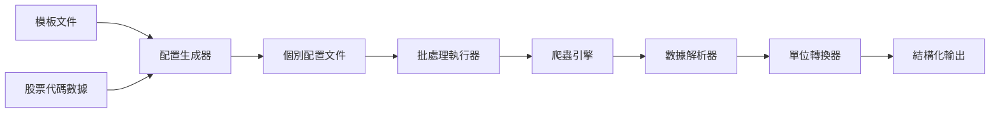

# Yahoo Finance Japan 使用指南

## 概述

Yahoo Finance Japan 爬蟲是專門針對日本雅虎財經網站設計的智能數據提取系統，能夠自動解析股票財務表格，並將數據轉換為結構化格式。

## 核心功能

### 🎯 智能表格解析
- 自動識別財務表格標題和數據
- 動態適應不同公司的表格結構
- 支援多年度財務數據比較

### 💱 單位自動轉換
- **百万円** → 實際金額（乘以 1,000,000）
- **百分比** → 小數格式（如 1.96% → 0.0196）
- 智能識別表格標題中的單位資訊

### 📊 結構化輸出
```json
{
  "stockInfo": "ソニーグループ(株)の業績・財務・キャッシュフロー",
  "structuredPerformanceData": [
    {
      "fiscalPeriod": "2025年3月期",
      "revenue": 12034917000000,
      "grossProfit": 3530107000000,
      "grossMargin": 0.2933,
      "operatingProfit": 1407163000000,
      "operatingMargin": null,
      "ordinaryProfit": null,
      "ordinaryMargin": null,
      "netProfit": null,
      "accountingMethod": null,
      "updateDate": null
    }
  ]
}
```

## 快速開始

### 1. 單一股票爬取

```bash
# 執行單一股票代碼
npm run crawl yahoo-finance-jp-7901_T

# 輸出文件格式
# output/yahoo-finance-jp-7901_T_crawl_results_20250731081859.json
```

### 2. 批量股票處理

```bash
# 生成批處理配置
node scripts/generate-batch-configs.js

# 執行批量爬取
node scripts/run-yahoo-finance-batch.js
```

## 架構說明

### 文件組織結構

```
/crawler/
├── configs/
│   ├── templates/                              # 配置模板
│   │   └── yahoo-finance-jp-performance.json   # 主要模板
│   ├── active/                                 # 生成的配置
│   │   ├── yahoo-finance-jp-143A_T.json        # イシン(株)
│   │   ├── yahoo-finance-jp-6758_T.json        # ソニーグループ
│   │   ├── yahoo-finance-jp-7203_T.json        # トヨタ自動車
│   │   ├── yahoo-finance-jp-7901_T.json        # マツモト
│   │   └── yahoo-finance-jp-9984_T.json        # ソフトバンクグループ
│   └── yahoo-finance-jp-*.json                 # 執行配置（根目錄）
├── data/
│   └── yahoo-finance-jp-stockcodes.json        # 股票代碼數據源
├── scripts/
│   ├── generate-batch-configs.js               # 配置生成器
│   └── run-yahoo-finance-batch.js              # 批處理執行器
└── output/
    └── yahoo-finance-jp-*_crawl_results_*.json # 結果輸出
```

### 數據流程



## 配置管理

### 股票代碼數據源
文件位置：`data/yahoo-finance-jp-stockcodes.json`

```json
[
  {
    "stockCode": "7901.T",
    "companyName": "(株)マツモト",
    "sector": "小売業"
  },
  {
    "stockCode": "143A.T", 
    "companyName": "イシン(株)",
    "sector": "食料品"
  }
]
```

### 配置模板
文件位置：`configs/templates/yahoo-finance-jp-performance.json`

主要配置項目：
- **URL 模板**：`https://finance.yahoo.co.jp/quote/${stockCode}/performance?styl=performance`
- **選擇器**：表格數據提取規則
- **轉換器**：`structureFinancialDataFromAllTableCells` 函數
- **輸出設置**：JSON 格式，自定義文件名

## 使用案例

### 案例 1：新增股票代碼

1. 編輯 `data/yahoo-finance-jp-stockcodes.json`：
```json
[
  {
    "stockCode": "4755.T",
    "companyName": "楽天グループ(株)",
    "sector": "情報・通信業"
  }
]
```

2. 重新生成配置：
```bash
node scripts/generate-batch-configs.js
```

3. 執行爬取：
```bash
npm run crawl yahoo-finance-jp-4755_T
```

### 案例 2：修改輸出格式

編輯模板文件 `configs/templates/yahoo-finance-jp-performance.json`：

```json
{
  "export": {
    "formats": ["json", "csv"],
    "filename": "financial_data_${stockCode}"
  }
}
```

### 案例 3：自定義等待時間

```json
{
  "options": {
    "domainDelay": 8000,
    "waitFor": 3000
  }
}
```

## 數據結構說明

### 輸出欄位對應

| 中文欄位 | 英文欄位 | 單位轉換 | 說明 |
|---------|---------|---------|------|
| 売上高 | revenue | 百万円 × 1,000,000 | 營業收入 |
| 売上総利益 | grossProfit | 百万円 × 1,000,000 | 毛利潤 |
| 売上総利益率 | grossMargin | % ÷ 100 | 毛利率 |
| 営業利益 | operatingProfit | 百万円 × 1,000,000 | 營業利潤 |
| 営業利益率 | operatingMargin | % ÷ 100 | 營業利潤率 |
| 経常利益 | ordinaryProfit | 百万円 × 1,000,000 | 經常利潤 |
| 経常利益率 | ordinaryMargin | % ÷ 100 | 經常利潤率 |
| 純利益 | netProfit | 百万円 × 1,000,000 | 淨利潤 |

### 單位識別邏輯

系統會自動分析表格標題來決定單位轉換：

```javascript
// 百万円 相關標題
if (header.includes('百万円') || header.includes('百萬圓')) {
  multiplier = 1000000;
}

// 百分比相關標題  
if (header.includes('%') || header.includes('率')) {
  multiplier = 0.01;
}
```

## 故障排除

### 常見問題

#### 1. 股票代碼格式錯誤
**症狀**：404 錯誤或無法找到頁面
**解決**：確認股票代碼格式正確（如 `7901.T`）

#### 2. 表格解析失敗
**症狀**：`structuredPerformanceData` 為空
**解決**：檢查網站結構是否變更，更新選擇器配置

#### 3. 單位轉換異常
**症狀**：數值過大或過小
**解決**：檢查 `src/const/finance.ts` 中的單位映射

#### 4. 批處理中斷
**症狀**：部分股票處理成功，部分失敗
**解決**：檢查網絡連接，適當增加延遲時間

### 除錯技巧

#### 啟用詳細日誌
```bash
DEBUG=true npm run crawl yahoo-finance-jp-7901_T
```

#### 檢查網頁內容
```bash
# 啟用截圖功能
"options": {
  "screenshot": true
}
```

#### 手動測試單一配置
```bash
# 測試特定配置
npm run crawl yahoo-finance-jp-7901_T
```

## 進階功能

### 自定義轉換函數

在 `src/transforms/sites/yahoo-finance-jp.ts` 中新增：

```javascript
export function customFinancialTransform(data: any[]): any {
  // 自定義轉換邏輯
  return processedData;
}
```

### 新增財務指標

修改 `src/const/finance.ts`：

```javascript
export const FINANCIAL_HEADERS = {
  // 現有欄位...
  'ROE': 'returnOnEquity',
  'ROA': 'returnOnAssets'
};
```

### 多年度比較分析

系統已支援多年度數據比較，輸出格式會包含歷史數據陣列。

## 性能優化

### 建議設置

```json
{
  "options": {
    "timeout": 30000,
    "retries": 3,
    "domainDelay": 5000,
    "concurrent": 1
  }
}
```

### 批處理最佳實踐

1. **順序執行**：避免並發請求導致 IP 封鎖
2. **適當延遲**：批處理腳本已內建 3 秒延遲
3. **錯誤重試**：配置適當的重試次數
4. **監控日誌**：定期檢查執行狀況

## 版本更新記錄

### v1.0.0 (2025-07-31)
- ✅ 智能表格解析功能
- ✅ 單位自動轉換
- ✅ 批處理架構
- ✅ 檔案命名格式優化 (yyyymmddhhmmss)
- ✅ 數據結構簡化

### 未來計劃
- 支援更多財務指標
- 增加數據驗證機制
- 提供 API 接口
- 支援即時數據更新

## 聯繫支援

如遇到問題或需要功能建議，請：

1. 檢查本文件的故障排除章節
2. 查看 `logs/` 目錄下的詳細日誌
3. 聯繫開發團隊

---

*最後更新：2025-07-31*