# Yahoo Finance Japan 開發指南

## 📋 目錄

1. [系統架構概述](#系統架構概述)
2. [數據類型支援](#數據類型支援)
3. [Financials 頁面開發](#financials-頁面開發)
4. [Performance 頁面開發](#performance-頁面開發)
5. [通用解析架構](#通用解析架構)
6. [開發工作流程](#開發工作流程)
7. [除錯與測試](#除錯與測試)
8. [擴展新數據類型](#擴展新數據類型)

---

## 系統架構概述

### 🏗️ 核心架構設計

Yahoo Finance Japan 爬蟲系統採用**雙重解析引擎**架構，針對不同數據類型採用最適合的解析策略：



### 📁 文件結構

```
/src/
├── const/
│   └── finance.ts              # 財務常數定義
├── transforms/sites/
│   └── yahoo-finance-jp.ts     # 主要轉換邏輯
├── index.ts                    # 爬蟲引擎主檔
└── crawler/
    └── PlaywrightCrawler.ts    # 瀏覽器爬蟲實現

/configs/
├── templates/
│   ├── yahoo-finance-jp-financials.json   # Financials 模板
│   └── yahoo-finance-jp-performance.json  # Performance 模板
└── active/
    ├── yahoo-finance-jp-financials-*.json # 生成的 Financials 配置
    └── yahoo-finance-jp-performance-*.json # 生成的 Performance 配置
```

---

## 數據類型支援

### 🎯 支援的數據類型

| 數據類型 | 頁面標識 | 爬蟲模式 | 解析策略 | 數據筆數 |
|---------|---------|----------|----------|----------|
| **Financials** | `?styl=financials` | Browser | 固定表頭順序 | 3 年度 |
| **Performance** | `?styl=performance` | HTTP | 動態表頭檢測 | 4 年度 |

### 📊 數據欄位對比

#### Financials 數據欄位
```typescript
interface FinancialsData {
  fiscalPeriod: string;         // 會計年度
  eps: number;                  // 每股盈餘 (円)
  bps: number;                  // 每股淨值 (円)
  roa: number;                  // 資產報酬率 (小數)
  roe: number;                  // 權益報酬率 (小數)
  totalAssets: number;          // 總資產 (円)
  equityRatio: number;          // 自己資本比率 (小數)
  capital: number;              // 資本金 (円)
  dividendYield: number;        // 有利子負債 (円)
  reductionAmount: number;      // 減價償却費 (円)
  stockCount: number;           // 發行股票總數 (股)
}
```

#### Performance 數據欄位
```typescript
interface PerformanceData {
  fiscalPeriod: string;         // 會計年度
  revenue: number;              // 營收 (円)
  grossProfit: number;          // 毛利 (円)
  grossMargin: number;          // 毛利率 (小數)
  operatingProfit: number;      // 營業利益 (円)
  operatingMargin: number;      // 營業利益率 (小數)
  ordinaryProfit: number;       // 經常利益 (円)
  ordinaryMargin: number;       // 經常利益率 (小數)
  netProfit: number;            // 純利益 (円)
  accountingMethod: string;     // 會計方式
  updateDate: string;           // 更新日期
}
```

---

## Financials 頁面開發

### 🔧 開發特點

**Financials 頁面採用簡化的固定表頭解析策略，因為其表格結構相對固定且標準化。**

#### 1. 頁面特性
- **JavaScript 渲染**：需要瀏覽器模式
- **固定表頭順序**：EPS → BPS → ROA → ROE → 總資產...
- **標準化格式**：所有公司使用相同的表格結構
- **3 個年度數據**：通常包含最近 3 年的財務數據

#### 2. 解析流程

```javascript
// 位置：src/transforms/sites/yahoo-finance-jp.ts
function parseFinancialsData(cells: string[]): FinancialData[] {
  // 步驟 1: 找到數據起始位置 (跳過表頭)
  let dataStartIndex = -1;
  for (let i = 0; i < cells.length; i++) {
    if (cells[i] && yahooFinanceJPTransforms.extractFiscalPeriod(cells[i])) {
      dataStartIndex = i;
      break;
    }
  }
  
  // 步驟 2: 按固定順序解析 10 個欄位
  const FINANCIALS_COLUMN_ORDER = [
    'EPS（円）',           // 0 - EPS
    'BPS（円）',           // 1 - BPS
    'ROA',                // 2 - ROA
    'ROE',                // 3 - ROE
    '総資産（百万円）',      // 4 - 總資產
    '自己資本比率',         // 5 - 自己資本比率
    '資本金（百万円）',      // 6 - 資本金
    '有利子負債（百万円）',   // 7 - 有利子負債
    '減価償却費（百万円）',   // 8 - 減價償却費
    '発行済み株式総数（千株）' // 9 - 發行股票總數
  ];
  
  // 步驟 3: 逐行解析數據
  while (currentIndex < cells.length) {
    const fiscalPeriod = extractFiscalPeriod(cells[currentIndex]);
    if (fiscalPeriod) {
      // 收集該行的 10 個數據欄位
      const rowData = cells.slice(currentIndex + 1, currentIndex + 11);
      
      // 步驟 4: 單位轉換和數據清理
      const financialData = {
        fiscalPeriod: fiscalPeriod,
        eps: parseFloat(rowData[0]) || null,
        bps: parseFloat(rowData[1]) || null,
        roa: parsePercentageToDecimal(rowData[2]),
        roe: parsePercentageToDecimal(rowData[3]),
        totalAssets: parseMillionYenToNumber(rowData[4]),
        // ... 其他欄位
      };
    }
  }
}
```

#### 3. 單位轉換函數

```javascript
// 百分比轉小數 (8.07% → 0.0807)
function parsePercentageToDecimal(value: string): number | null {
  if (!value || value === '---') return null;
  const percentStr = value.replace('%', '').trim();
  const num = parseFloat(percentStr);
  return isNaN(num) ? null : num / 100;
}

// 百萬円轉實際円 (2,201 → 2,201,000,000)
function parseMillionYenToNumber(value: string): number | null {
  if (!value || value === '---') return null;
  const cleanValue = value.replace(/[,\s]/g, '');
  const num = parseFloat(cleanValue);
  return isNaN(num) ? null : num * 1000000;
}

// 千株轉實際股數 (1,917 → 1,917,000)
function parseThousandToNumber(value: string): number | null {
  if (!value || value === '---') return null;
  const cleanValue = value.replace(/[,\s]/g, '');
  const num = parseFloat(cleanValue);
  return isNaN(num) ? null : num * 1000;
}
```

#### 4. 配置文件設置

```json
{
  "templateType": "financials",
  "url": "https://finance.yahoo.co.jp/quote/${stockCode}/performance?styl=financials",
  "selectors": {
    "stockInfo": {
      "selector": "h1, .symbol",
      "transform": "cleanStockSymbol"
    },
    "structuredFinancialData": {
      "selector": "table td, table th",
      "multiple": true,
      "transform": "structureFinancialDataFromAllTableCells"
    }
  },
  "options": {
    "timeout": 30000,
    "waitFor": 10000,
    "headless": true
  }
}
```

#### 5. 瀏覽器模式強制執行

```javascript
// 位置：src/index.ts
private isHttpCompatible(config: CrawlerConfig): boolean {
  // Force browser mode for Yahoo Finance Japan dynamic pages
  const url = config.url.toLowerCase();
  if (url.includes('finance.yahoo.co.jp') && url.includes('styl=financials')) {
    logger.debug('Yahoo Finance Japan financials page detected - forcing browser mode');
    return false; // 強制使用瀏覽器模式
  }
  return true;
}
```

---

## Performance 頁面開發

### 🔧 開發特點

**Performance 頁面採用複雜的動態表頭檢測策略，因為不同公司的表格結構可能有變化。**

#### 1. 頁面特性
- **靜態 HTML**：可以使用 HTTP 模式
- **動態表頭**：不同公司可能有不同的欄位組合
- **複雜結構**：需要智能的表頭檢測和數據重組
- **4 個年度數據**：通常包含最近 4 年的營運數據

#### 2. 表頭定義

```javascript
// 位置：src/const/finance.ts
export const YAHOO_FINANCE_JP_PERFORMANCE_HEADERS = {
  REVENUE: '売上高（百万円）',
  GROSS_PROFIT: '売上総利益（百万円）',
  GROSS_MARGIN: '粗利率',
  OPERATING_PROFIT: '営業利益（百万円）',
  OPERATING_MARGIN: '営業利益率',
  ORDINARY_PROFIT: '経常利益（百万円）',
  ORDINARY_MARGIN: '経常利益率',
  NET_PROFIT: '純利益（百万円）',
  ACCOUNTING_METHOD: '会計方式',
  UPDATE_DATE: '財務数値更新日'
} as const;

export const PERFORMANCE_DATA_FIELD_MAPPING = {
  revenue: YAHOO_FINANCE_JP_PERFORMANCE_HEADERS.REVENUE,
  grossProfit: YAHOO_FINANCE_JP_PERFORMANCE_HEADERS.GROSS_PROFIT,
  grossMargin: YAHOO_FINANCE_JP_PERFORMANCE_HEADERS.GROSS_MARGIN,
  operatingProfit: YAHOO_FINANCE_JP_PERFORMANCE_HEADERS.OPERATING_PROFIT,
  operatingMargin: YAHOO_FINANCE_JP_PERFORMANCE_HEADERS.OPERATING_MARGIN,
  ordinaryProfit: YAHOO_FINANCE_JP_PERFORMANCE_HEADERS.ORDINARY_PROFIT,
  ordinaryMargin: YAHOO_FINANCE_JP_PERFORMANCE_HEADERS.ORDINARY_MARGIN,
  netProfit: YAHOO_FINANCE_JP_PERFORMANCE_HEADERS.NET_PROFIT,
  accountingMethod: YAHOO_FINANCE_JP_PERFORMANCE_HEADERS.ACCOUNTING_METHOD,
  updateDate: YAHOO_FINANCE_JP_PERFORMANCE_HEADERS.UPDATE_DATE
} as const;
```

#### 3. 複雜解析流程

```javascript
function parsePerformanceDataLegacy(cells: string[]): FinancialData[] {
  // 步驟 1: 找到包含完整數據的字符串
  let dataString = '';
  const keyHeaders = ['売上高（百万円）', '営業利益（百万円）'];
  
  for (const cell of cells) {
    if (typeof cell === 'string') {
      const hasKeyHeader = keyHeaders.some(header => cell.includes(header));
      if (hasKeyHeader && cell.includes('年3月期')) {
        dataString = cell;
        break;
      }
    }
  }
  
  // 步驟 2: 分割數據並找到表頭起始位置
  const cellArray = dataString.split(',').map(cell => cell.trim()).filter(cell => cell !== '');
  const headerStartIndex = cellArray.findIndex(cell => cell === '売上高（百万円）');
  
  // 步驟 3: 按順序收集實際存在的標題
  const expectedHeaders = YAHOO_FINANCE_JP_HEADER_ORDER;
  const headers = [];
  let headerIndex = headerStartIndex;
  
  for (const expectedHeader of expectedHeaders) {
    if (headerIndex < cellArray.length && cellArray[headerIndex] === expectedHeader) {
      headers.push(expectedHeader);
      headerIndex++;
    } else {
      // 容錯處理：嘗試找到下一個預期的標題
      const foundIndex = cellArray.indexOf(expectedHeader, headerIndex);
      if (foundIndex !== -1 && foundIndex < headerIndex + 3) {
        headers.push(expectedHeader);
        headerIndex = foundIndex + 1;
      } else {
        break; // 某些標題可能不存在
      }
    }
  }
  
  // 步驟 4: 解析數據行
  let currentIndex = headerStartIndex + headers.length;
  while (currentIndex < cellArray.length) {
    const fiscalPeriod = extractFiscalPeriod(cellArray[currentIndex]);
    if (fiscalPeriod) {
      // 收集該行數據直到遇到下一個年度
      const rowData = [];
      let collectIndex = currentIndex + 1;
      
      while (collectIndex < cellArray.length) {
        const nextCell = cellArray[collectIndex];
        if (extractFiscalPeriod(nextCell)) break;
        rowData.push(nextCell);
        collectIndex++;
      }
      
      // 步驟 5: 重組被逗號分割的大數字
      const restructuredData = restructureNumericDataForHeaders(rowData);
      
      // 步驟 6: 映射到標準化結構
      const headerValueMap: { [key: string]: any } = {};
      headers.forEach((header, index) => {
        if (index < restructuredData.length) {
          let value = restructuredData[index];
          
          // 智能單位轉換
          if (isAmountHeader(header) || isPercentageHeader(header)) {
            value = parseValueByHeader(value, header);
          } else if (header.includes('会計方式')) {
            value = cleanAccountingMethod(value || '');
          }
          
          headerValueMap[header] = value;
        }
      });
      
      // 步驟 7: 使用映射常數創建標準化結構
      const financialData = { fiscalPeriod };
      Object.entries(PERFORMANCE_DATA_FIELD_MAPPING).forEach(([field, header]) => {
        (financialData as any)[field] = headerValueMap[header] || null;
      });
      
      results.push(financialData);
      currentIndex = collectIndex;
    } else {
      currentIndex++;
    }
  }
}
```

#### 4. 數據重組邏輯

```javascript
// 重組被逗號分割的大數字
function restructureNumericDataForHeaders(rowData: string[]): string[] {
  const result: string[] = [];
  let currentIndex = 0;
  
  while (currentIndex < rowData.length) {
    const currentValue = rowData[currentIndex];
    
    // 處理特殊值 ("---", "IFRS", 百分比等)
    if (currentValue === '---' || currentValue.includes('%') || 
        currentValue.includes('IFRS') || currentValue.includes('日本会計')) {
      result.push(currentValue);
      currentIndex++;
    } else if (/^\d+$/.test(currentValue)) {
      // 處理純數字，檢查是否需要重組
      let reconstructedNumber = currentValue;
      let combinedCount = 0;
      
      // 檢查下一個元素是否是數字的千位分隔符部分
      while (currentIndex + 1 < rowData.length && combinedCount < 3) {
        const nextValue = rowData[currentIndex + 1];
        
        if (/^\d{1,3}$/.test(nextValue)) {
          // 智能決策是否需要重組
          let shouldCombine = false;
          
          if (currentIndex + 2 < rowData.length) {
            const valueAfterNext = rowData[currentIndex + 2];
            // 如果後面是特殊值，則重組當前數字
            if (valueAfterNext.includes('%') || 
                valueAfterNext === '---' ||
                (nextValue.length === 3 && reconstructedNumber.length >= 1)) {
              shouldCombine = true;
            }
          }
          
          if (shouldCombine) {
            reconstructedNumber = reconstructedNumber + ',' + nextValue;
            currentIndex++;
            combinedCount++;
          } else {
            break;
          }
        } else {
          break;
        }
      }
      
      result.push(reconstructedNumber);
      currentIndex++;
    } else {
      result.push(currentValue);
      currentIndex++;
    }
  }
  
  return result;
}
```

---

## 通用解析架構

### 🚀 路由系統

系統使用智能路由來決定使用哪種解析策略：

```javascript
// 位置：src/transforms/sites/yahoo-finance-jp.ts
structureFinancialDataFromAllTableCells: (cells: string[], context?: any): FinancialData[] => {
  // 步驟 1: 確定數據類型
  let dataType: 'performance' | 'financials' = context?.templateType || 'performance';
  
  if (!context?.templateType) {
    // 自動檢測數據類型
    const allText = cells.join(' ');
    const headers = allText.split(',').map(h => h.trim());
    dataType = detectDataTypeFromHeaders(headers);
  }
  
  // 步驟 2: 路由到對應的解析器
  if (dataType === 'financials') {
    return parseFinancialsData(cells);
  } else {
    return parsePerformanceDataLegacy(cells);
  }
}
```

### 📋 自動檢測邏輯

```javascript
// 位置：src/const/finance.ts
export function detectDataTypeFromHeaders(headers: string[]): 'performance' | 'financials' {
  // 檢查是否包含 financials 特有的標題
  const financialsKeywords = ['EPS（円）', 'BPS（円）', 'EPS', 'BPS', 'ROA', 'ROE', '総資産', '自己資本比率'];
  const hasFinancialsHeaders = headers.some(header => 
    financialsKeywords.some(keyword => header.includes(keyword))
  );
  
  if (hasFinancialsHeaders) {
    return 'financials';
  }
  
  // 檢查是否包含 performance 特有的標題
  const performanceKeywords = ['売上高（百万円）', '営業利益（百万円）', '経常利益（百万円）', '純利益（百万円）'];
  const hasPerformanceHeaders = headers.some(header => 
    performanceKeywords.some(keyword => header.includes(keyword))
  );
  
  if (hasPerformanceHeaders) {
    return 'performance';
  }
  
  // 預設為 performance
  return 'performance';
}
```

### 🔧 單位轉換系統

```javascript
// 位置：src/const/finance.ts
export const UNIT_MULTIPLIERS = {
  MILLION_YEN: 1000000,    // 百万円 → 實際円
  PERCENTAGE: 0.01         // % → 小數
} as const;

export function getUnitMultiplier(header: string): number {
  if (header.includes('百万円')) {
    return UNIT_MULTIPLIERS.MILLION_YEN;
  } else if (header.includes('率') || header.includes('%')) {
    return UNIT_MULTIPLIERS.PERCENTAGE;
  }
  return 1; // 無需轉換
}

// 智能數值解析函數
function parseValueByHeader(value: string, header: string): number | null {
  if (!value || value === '---') return null;
  
  const cleanValue = value.replace(/[,\s]/g, '');
  const numValue = parseFloat(cleanValue);
  
  if (isNaN(numValue)) return null;
  
  // 根據標題類型進行單位轉換
  const multiplier = getUnitMultiplier(header);
  return numValue * multiplier;
}
```

---

## 開發工作流程

### 🛠️ 新增股票代碼流程

#### 1. 更新股票代碼數據源
```bash
# 編輯數據源文件
vi data/yahoo-finance-jp-stockcodes.json
```

```json
[
  {
    "stockCode": "新股票代碼.T",
    "companyName": "公司名稱",
    "sector": "行業別"
  }
]
```

#### 2. 生成配置文件
```bash
# 自動生成所有配置
node scripts/generate-batch-configs.js

# 檢查生成的配置
ls configs/active/yahoo-finance-jp-*新股票代碼*.json
```

#### 3. 測試單一配置
```bash
# 測試 Performance 數據
npm run crawl yahoo-finance-jp-performance-新股票代碼

# 測試 Financials 數據  
npm run crawl yahoo-finance-jp-financials-新股票代碼
```

#### 4. 批量執行
```bash
# 執行批量處理
node scripts/run-yahoo-finance-batch.js
```

### 🔄 新增數據類型流程

#### 1. 定義常數
```javascript
// 在 src/const/finance.ts 中新增
export const YAHOO_FINANCE_JP_CASHFLOW_HEADERS = {
  OPERATING_CASH: '營業現金流（百万円）',
  INVESTING_CASH: '投資現金流（百万円）',
  FINANCING_CASH: '融資現金流（百万円）'
} as const;

export const CASHFLOW_DATA_FIELD_MAPPING = {
  operatingCash: YAHOO_FINANCE_JP_CASHFLOW_HEADERS.OPERATING_CASH,
  investingCash: YAHOO_FINANCE_JP_CASHFLOW_HEADERS.INVESTING_CASH,
  financingCash: YAHOO_FINANCE_JP_CASHFLOW_HEADERS.FINANCING_CASH
} as const;
```

#### 2. 實現解析函數
```javascript
// 在 src/transforms/sites/yahoo-finance-jp.ts 中新增
function parseCashflowData(cells: string[]): FinancialData[] {
  // 實現特定的解析邏輯
}
```

#### 3. 更新路由系統
```javascript
// 在 structureFinancialDataFromAllTableCells 中新增
if (dataType === 'cashflow') {
  return parseCashflowData(cells);
}
```

#### 4. 創建配置模板
```json
{
  "templateType": "cashflow",
  "url": "https://finance.yahoo.co.jp/quote/${stockCode}/performance?styl=cashflow",
  "selectors": {
    "structuredFinancialData": {
      "selector": "table td, table th",
      "multiple": true,
      "transform": "structureFinancialDataFromAllTableCells"
    }
  }
}
```

---

## 除錯與測試

### 🔍 除錯工具

#### 1. 啟用詳細日誌
```bash
# 設置環境變數
export DEBUG=crawler:*
npm run crawl yahoo-finance-jp-financials-143A_T
```

#### 2. 截圖除錯
```json
{
  "options": {
    "screenshot": true,
    "headless": false
  }
}
```

#### 3. 數據檢查點
```javascript
// 在解析函數中新增檢查點
console.log('[DEBUG] Cells received:', cells.length);
console.log('[DEBUG] First 5 cells:', cells.slice(0, 5));
console.log('[DEBUG] Data type detected:', dataType);
```

### 🧪 測試流程

#### 1. 單元測試
```bash
# 測試特定轉換函數
npm run test -- --grep "yahoo-finance-jp"
```

#### 2. 整合測試
```bash
# 測試完整流程
npm run crawl yahoo-finance-jp-performance-143A_T
npm run crawl yahoo-finance-jp-financials-143A_T
```

#### 3. 批量測試
```bash
# 測試批量處理（小批量）
node scripts/run-yahoo-finance-batch.js --limit 3
```

### 🚨 常見問題排除

#### 1. 空數據問題
**症狀**：`structuredPerformanceData: []`

**排查步驟**：
```bash
# 1. 檢查網頁是否可訪問
curl -I "https://finance.yahoo.co.jp/quote/143A.T/performance?styl=financials"

# 2. 檢查選擇器是否正確
# 啟用截圖模式查看實際頁面

# 3. 檢查數據類型檢測
# 在解析函數中加入 console.log
```

#### 2. 單位轉換錯誤
**症狀**：數值過大或過小

**解決方案**：
```javascript
// 檢查 finance.ts 中的單位映射
console.log('Header:', header);
console.log('Multiplier:', getUnitMultiplier(header));
console.log('Original value:', value);
console.log('Converted value:', value * getUnitMultiplier(header));
```

#### 3. 瀏覽器模式問題
**症狀**：Financials 頁面返回空數據

**檢查**：
```javascript
// 確認 isHttpCompatible 函數正確判斷
if (url.includes('styl=financials')) {
  console.log('Forcing browser mode for financials');
  return false;
}
```

---

## 擴展新數據類型

### 📈 支援現金流數據

以下是新增現金流（Cashflow）數據類型的完整範例：

#### 1. 常數定義
```javascript
// src/const/finance.ts
export const YAHOO_FINANCE_JP_CASHFLOW_HEADERS = {
  OPERATING_CASH: '営業活動による現金流（百万円）',
  INVESTING_CASH: '投資活動による現金流（百万円）',
  FINANCING_CASH: '財務活動による現金流（百万円）',
  FREE_CASH_FLOW: 'フリーキャッシュフロー（百万円）',
  CASH_POSITION: '現金及び現金同等物（百万円）'
} as const;

export const CASHFLOW_DATA_FIELD_MAPPING = {
  operatingCash: YAHOO_FINANCE_JP_CASHFLOW_HEADERS.OPERATING_CASH,
  investingCash: YAHOO_FINANCE_JP_CASHFLOW_HEADERS.INVESTING_CASH,
  financingCash: YAHOO_FINANCE_JP_CASHFLOW_HEADERS.FINANCING_CASH,
  freeCashFlow: YAHOO_FINANCE_JP_CASHFLOW_HEADERS.FREE_CASH_FLOW,
  cashPosition: YAHOO_FINANCE_JP_CASHFLOW_HEADERS.CASH_POSITION
} as const;
```

#### 2. 介面擴展
```typescript
// src/transforms/sites/yahoo-finance-jp.ts
export interface FinancialData {
  fiscalPeriod: string | null;
  
  // Performance 欄位
  revenue?: number | null;
  // ... 其他 Performance 欄位
  
  // Financials 欄位  
  eps?: number | null;
  // ... 其他 Financials 欄位
  
  // Cashflow 欄位
  operatingCash?: number | null;
  investingCash?: number | null;
  financingCash?: number | null;
  freeCashFlow?: number | null;
  cashPosition?: number | null;
}
```

#### 3. 解析函數實現
```javascript
function parseCashflowData(cells: string[]): FinancialData[] {
  const results: FinancialData[] = [];
  
  // 找到數據起始位置
  let dataStartIndex = -1;
  for (let i = 0; i < cells.length; i++) {
    if (cells[i] && yahooFinanceJPTransforms.extractFiscalPeriod(cells[i])) {
      dataStartIndex = i;
      break;
    }
  }
  
  if (dataStartIndex === -1) return results;
  
  // 按行解析數據
  let currentIndex = dataStartIndex;
  while (currentIndex < cells.length) {
    const fiscalPeriod = yahooFinanceJPTransforms.extractFiscalPeriod(cells[currentIndex]);
    
    if (fiscalPeriod) {
      const rowData = cells.slice(currentIndex + 1, currentIndex + 6); // 5 個欄位
      
      if (rowData.length >= 5) {
        const financialData: FinancialData = {
          fiscalPeriod: fiscalPeriod,
          operatingCash: parseMillionYenToNumber(rowData[0]),
          investingCash: parseMillionYenToNumber(rowData[1]),
          financingCash: parseMillionYenToNumber(rowData[2]),
          freeCashFlow: parseMillionYenToNumber(rowData[3]),
          cashPosition: parseMillionYenToNumber(rowData[4])
        };
        
        results.push(financialData);
      }
      
      currentIndex += 6; // 移動到下一行
    } else {
      currentIndex++;
    }
  }
  
  return results;
}
```

#### 4. 路由系統更新
```javascript
// 更新 detectDataTypeFromHeaders 函數
export function detectDataTypeFromHeaders(headers: string[]): 'performance' | 'financials' | 'cashflow' {
  // 檢查 cashflow 關鍵字
  const cashflowKeywords = ['現金流', 'キャッシュフロー', '営業活動', '投資活動', '財務活動'];
  const hasCashflowHeaders = headers.some(header => 
    cashflowKeywords.some(keyword => header.includes(keyword))
  );
  
  if (hasCashflowHeaders) {
    return 'cashflow';
  }
  
  // ... 其他檢查邏輯
}

// 更新主要路由函數
structureFinancialDataFromAllTableCells: (cells: string[], context?: any): FinancialData[] => {
  let dataType = context?.templateType || 'performance';
  
  if (!context?.templateType) {
    dataType = detectDataTypeFromHeaders(headers);
  }
  
  if (dataType === 'financials') {
    return parseFinancialsData(cells);
  } else if (dataType === 'cashflow') {
    return parseCashflowData(cells);
  } else {
    return parsePerformanceDataLegacy(cells);
  }
}
```

#### 5. 配置模板
```json
{
  "templateType": "cashflow",
  "url": "https://finance.yahoo.co.jp/quote/${stockCode}/performance?styl=cashflow",
  "selectors": {
    "stockInfo": {
      "selector": "h1, .symbol",
      "transform": "cleanStockSymbol"
    },
    "structuredFinancialData": {
      "selector": "table td, table th",
      "multiple": true,
      "transform": "structureFinancialDataFromAllTableCells"
    }
  },
  "options": {
    "timeout": 30000,
    "retries": 3,
    "waitFor": 5000
  }
}
```

---

## 總結

### ✅ 現有功能
- **雙重解析引擎**：支援 Financials 和 Performance 兩種數據類型
- **智能路由系統**：根據 templateType 自動選擇解析策略
- **完整單位轉換**：百萬円、百分比、千株等單位正確轉換
- **錯誤容錯機制**：處理缺失數據和格式變化

### 🚀 擴展能力
- **模組化設計**：新數據類型可輕鬆集成
- **配置驅動**：透過模板文件控制行為
- **自動檢測**：智能識別不同數據類型
- **批量處理**：支援大規模股票數據採集

### 📋 最佳實踐
1. **先測試單一配置**，確認解析邏輯正確
2. **使用截圖除錯**，了解實際頁面結構
3. **遵循命名慣例**，保持代碼一致性
4. **適當新增日誌**，便於問題排查
5. **定期更新股票代碼**，保持數據源最新

---

*最後更新：2025-07-31*
*版本：v2.0.0*