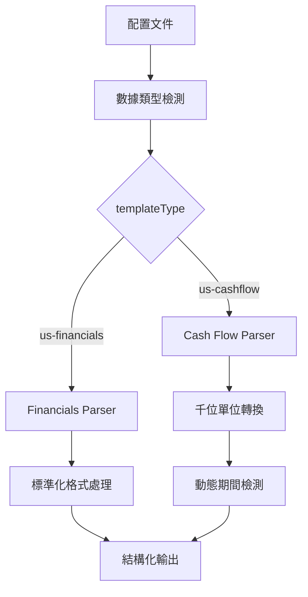

# Yahoo Finance US 開發指南

## 📋 目錄

1. [系統架構概述](#系統架構概述)
2. [數據類型支援](#數據類型支援)
3. [Cash Flow 頁面開發](#cash-flow-頁面開發)
4. [Financials 頁面開發](#financials-頁面開發)
5. [通用解析架構](#通用解析架構)
6. [開發工作流程](#開發工作流程)
7. [除錯與測試](#除錯與測試)
8. [擴展新數據類型](#擴展新數據類型)

---

## 系統架構概述

### 🏗️ 核心架構設計

Yahoo Finance US 爬蟲系統採用**模組化解析引擎**架構，針對不同數據類型提供專用的解析策略：



### 📁 文件結構

```
/src/
├── const/
│   └── finance.ts              # 財務常數定義
├── transforms/sites/
│   └── yahoo-finance-us.ts     # 美國版轉換邏輯
├── index.ts                    # 爬蟲引擎主檔
└── crawler/
    └── PlaywrightCrawler.ts    # 瀏覽器爬蟲實現

/configs/
├── templates/
│   ├── yahoo-finance-us-cashflow.json    # Cash Flow 模板
│   └── yahoo-finance-us-financials.json  # Financials 模板
└── active/
    ├── yahoo-finance-us-cashflow-*.json   # 生成的 Cash Flow 配置
    └── yahoo-finance-us-financials-*.json # 生成的 Financials 配置

/data/
└── yahoo-finance-us-stockcodes.json      # 美國股票代碼數據源

/scripts/
├── generate-yahoo-us-configs.js          # 配置生成器
├── run-yahoo-us-cashflow-batch.js        # Cash Flow 批量執行
└── run-yahoo-us-financials-batch.js      # Financials 批量執行
```

---

## 數據類型支援

### 🎯 支援的數據類型

| 數據類型 | 頁面標識 | 爬蟲模式 | 解析策略 | 數據筆數 | 狀態 |
|---------|---------|----------|----------|----------|------|
| **Cash Flow** | `/cash-flow/` | Browser | 動態表格解析 | 4 季度 | ✅ 完成 |
| **Financials** | `/financials/` | Browser | 標準表格解析 | 4 季度 | 🚧 開發中 |

### 📊 數據欄位對比

#### Cash Flow 數據欄位
```typescript
interface USCashFlowData {
  fiscalPeriod: string | null;             // 財務期間 (e.g., "9/30/2024")
  operatingCashFlow?: number | null;       // 營業現金流 (實際金額)
  investingCashFlow?: number | null;       // 投資現金流 (實際金額)
  financingCashFlow?: number | null;       // 融資現金流 (實際金額)
  endCashPosition?: number | null;         // 期末現金部位 (實際金額)
  capitalExpenditure?: number | null;      // 資本支出 (實際金額)
  issuanceOfCapitalStock?: number | null;  // 股本發行 (實際金額)
  issuanceOfDebt?: number | null;          // 債務發行 (實際金額)
  repaymentOfDebt?: number | null;         // 債務償還 (實際金額)
  repurchaseOfCapitalStock?: number | null;// 股份回購 (實際金額)
  freeCashFlow?: number | null;            // 自由現金流 (實際金額)
}
```

#### Financials 數據欄位
```typescript
interface USFinancialsData {
  fiscalPeriod: string | null;             // 財務期間
  totalRevenue?: number | null;            // 總營收 (實際金額)
  costOfRevenue?: number | null;           // 營收成本 (實際金額)
  grossProfit?: number | null;             // 毛利 (實際金額)
  operatingExpense?: number | null;        // 營業費用 (實際金額)
  operatingIncome?: number | null;         // 營業收入 (實際金額)
  interestExpense?: number | null;         // 利息費用 (實際金額)
  incomeBeforeTax?: number | null;         // 稅前收入 (實際金額)
  incomeTaxExpense?: number | null;        // 所得稅費用 (實際金額)
  netIncome?: number | null;               // 淨收入 (實際金額)
  basicEPS?: number | null;                // 基本每股盈餘 (美元)
  dilutedEPS?: number | null;              // 稀釋每股盈餘 (美元)
}
```

---

## Cash Flow 頁面開發

### 🔧 開發特點

**Cash Flow 頁面採用精密的個別行解析策略，確保期間與數據的正確對應。**

#### 1. 頁面特性
- **JavaScript 渲染**：需要瀏覽器模式
- **Quarterly 按鈕點擊**：必須點擊 Quarterly 按鈕獲取季度資料
- **動態期間檢測**：支援任何會計年度模式
- **單位轉換**：所有數字以千為單位，需乘以 1,000
- **缺失數據處理**：將 "--" 轉換為 null

#### 2. 核心解析流程

```javascript
// 位置：src/transforms/sites/yahoo-finance-us.ts
function structureUSCashFlowDataFromCells(cells: string[]): USCashFlowData[] {
  const results: USCashFlowData[] = [];
  
  // 步驟 1: 找到所有包含期間資訊的行
  const periodRows = [];
  for (let i = 0; i < cells.length; i++) {
    const periodMatch = cells[i].match(/\b(\d{1,2}\/\d{1,2}\/\d{4})\b/);
    if (periodMatch) {
      periodRows.push({
        index: i,
        period: periodMatch[1],
        text: cells[i]
      });
    }
  }
  
  // 步驟 2: 提取所有期間
  const periods = periodRows.map(row => row.period);
  if (periods.length === 0) return results;
  
  // 步驟 3: 為每個期間建立數據結構
  periods.forEach(period => {
    const cashFlowData: USCashFlowData = {
      fiscalPeriod: period
    };
    
    // 步驟 4: 解析各項現金流指標
    const metrics = Object.keys(US_CASHFLOW_HEADERS);
    metrics.forEach(metricKey => {
      const metricName = US_CASHFLOW_HEADERS[metricKey];
      const value = extractCashFlowMetricValue(cells, metricName, period);
      (cashFlowData as any)[metricKey] = value;
    });
    
    results.push(cashFlowData);
  });
  
  return results;
}
```

#### 3. 關鍵數據提取算法

```javascript
// 核心：從個別指標行中提取特定期間的數值
function extractCashFlowMetricValue(cells: string[], metric: string, period: string): number | null {
  // 找到包含指標名稱和數據的具體行
  for (const cell of cells) {
    if (!cell || typeof cell !== 'string') continue;
    
    // 建立動態正則表達式匹配指標行
    const metricLinePattern = new RegExp(
      `${metric.replace(/[.*+?^${}()|[\]\\]/g, '\\$&')}\\s+([\\d,\\-\\s]+)`, 'i'
    );
    const metricMatch = cell.match(metricLinePattern);
    
    if (!metricMatch) continue;
    
    // 從匹配的行中提取數值部分
    const dataSection = metricMatch[1];
    const values = dataSection.match(
      /(--)|(--)|(-?\d{1,3}(?:,\d{3})*(?:\.\d+)?[BMKbmk]?)|(-?\d+\.?\d*[eE][+-]?\d+)/g
    );
    
    if (!values) continue;
    
    // 找到對應期間的索引位置
    const periodIndex = findPeriodIndex(cell, period);
    if (periodIndex >= 0 && periodIndex < values.length) {
      const rawValue = values[periodIndex];
      const parsedValue = yahooFinanceUSTransforms.parseUSFinancialValue(rawValue);
      
      if (typeof parsedValue === 'number') {
        return parsedValue * 1000; // 千位轉換為實際數值
      }
    }
  }
  
  return null;
}
```

#### 4. 期間索引映射算法

```javascript
// 找到特定期間在數據行中的索引位置
function findPeriodIndex(cellText: string, targetPeriod: string): number {
  // 提取所有期間資訊
  const periodMatches = cellText.match(/\b\d{1,2}\/\d{1,2}\/\d{4}\b/g);
  if (!periodMatches) return -1;
  
  // 找到目標期間的索引
  return periodMatches.indexOf(targetPeriod);
}
```

#### 5. 單位轉換系統

```javascript
// US 財務數值解析 (處理千位分隔符和特殊格式)
parseUSFinancialValue: (value: string): number | null => {
  if (!value || value === '--' || value === '---') return null;
  
  // 清理格式並轉換
  const cleanValue = value.replace(/[,\s]/g, '');
  const num = parseFloat(cleanValue);
  
  if (isNaN(num)) return null;
  
  // 處理科學記號
  if (value.includes('e') || value.includes('E')) {
    return num;
  }
  
  // 處理單位後綴 (B=十億, M=百萬, K=千)
  if (value.includes('B') || value.includes('b')) {
    return num * 1000000000;
  } else if (value.includes('M') || value.includes('m')) {
    return num * 1000000;
  } else if (value.includes('K') || value.includes('k')) {
    return num * 1000;
  }
  
  return num;
}
```

#### 6. 配置文件設置

```json
{
  "templateType": "us-cashflow",
  "url": "https://finance.yahoo.com/quote/${stockCode}/cash-flow/",
  "variables": {
    "stockCode": "AAPL"
  },
  "actions": [
    {
      "type": "click",
      "selector": "button[data-testid=\"QUARTERLY\"], button[data-testid=\"Quarterly\"], .Quarterly, button[aria-label*=\"Quarterly\"], [data-icon=\"quarterly\"]"
    }
  ],
  "selectors": {
    "stockInfo": {
      "selector": "h1, .symbol",
      "transform": "cleanStockSymbol"
    },
    "structuredCashFlowData": {
      "selector": "table td, table th",
      "multiple": true,
      "transform": "structureUSCashFlowDataFromCells"
    }
  },
  "options": {
    "timeout": 30000,
    "retries": 3,
    "waitFor": 5000,
    "headless": true
  }
}
```

---

## Financials 頁面開發

### 🔧 開發特點

**Financials 頁面採用標準化表格解析策略，處理損益表數據。**

#### 1. 頁面特性
- **JavaScript 渲染**：需要瀏覽器模式
- **標準表格結構**：相對一致的表格格式
- **季度數據**：預設顯示季度資料
- **標準化欄位**：固定的財務報表項目

#### 2. 預計實現架構

```javascript
// 預計的 Financials 解析函數
function structureUSFinancialsDataFromCells(cells: string[]): USFinancialsData[] {
  // 類似 Cash Flow 的解析策略
  // 但針對損益表項目進行特化
}
```

---

## 通用解析架構

### 🚀 轉換系統路由

系統使用模組化轉換系統處理不同數據類型：

```javascript
// 位置：src/transforms/sites/yahoo-finance-us.ts
export const yahooFinanceUSTransforms = {
  // Cash Flow 專用轉換
  structureUSCashFlowDataFromCells: (cells: string[]): USCashFlowData[] => {
    return structureUSCashFlowDataFromCells(cells);
  },
  
  // Financials 專用轉換 (未來實現)
  structureUSFinancialsDataFromCells: (cells: string[]): USFinancialsData[] => {
    // 待實現
    return [];
  },
  
  // 通用工具函數
  parseUSFinancialValue: (value: string): number | null => {
    // 美國財務數值解析邏輯
  },
  
  cleanStockSymbol: (text: string): string => {
    // 股票符號清理邏輯
  }
};
```

### 📋 常數定義系統

```javascript
// 位置：src/const/finance.ts
export const US_CASHFLOW_HEADERS = {
  operatingCashFlow: 'Operating Cash Flow',
  investingCashFlow: 'Investing Cash Flow',
  financingCashFlow: 'Financing Cash Flow',
  endCashPosition: 'End Cash Position',
  capitalExpenditure: 'Capital Expenditure',
  issuanceOfCapitalStock: 'Issuance of Capital Stock',
  issuanceOfDebt: 'Issuance of Debt',
  repaymentOfDebt: 'Repayment of Debt',
  repurchaseOfCapitalStock: 'Repurchase of Capital Stock',
  freeCashFlow: 'Free Cash Flow'
} as const;

export const US_FINANCIALS_HEADERS = {
  totalRevenue: 'Total Revenue',
  costOfRevenue: 'Cost of Revenue',
  grossProfit: 'Gross Profit',
  operatingExpense: 'Operating Expense',
  operatingIncome: 'Operating Income',
  // ... 其他 Financials 欄位
} as const;
```

---

## 開發工作流程

### 🛠️ 新增股票代碼流程

#### 1. 更新股票代碼數據源
```bash
# 編輯數據源文件
vi data/yahoo-finance-us-stockcodes.json
```

```json
[
  {
    "stockCode": "新股票代碼",
    "companyName": "公司名稱",
    "sector": "行業別"
  }
]
```

#### 2. 生成配置文件
```bash
# 生成 Cash Flow 配置
node scripts/generate-yahoo-us-configs.js --type=cashflow

# 生成 Financials 配置
node scripts/generate-yahoo-us-configs.js --type=financials

# 生成所有類型配置
node scripts/generate-yahoo-us-configs.js
```

#### 3. 測試單一配置
```bash
# 測試 Cash Flow 數據
npm run crawl yahoo-finance-us-cashflow-新股票代碼

# 測試 Financials 數據
npm run crawl yahoo-finance-us-financials-新股票代碼
```

#### 4. 批量執行
```bash
# 執行 Cash Flow 批量處理
node scripts/run-yahoo-us-cashflow-batch.js

# 執行 Financials 批量處理
node scripts/run-yahoo-us-financials-batch.js
```

### 🔄 新增數據類型流程

#### 1. 定義介面和常數
```typescript
// 在 src/transforms/sites/yahoo-finance-us.ts 中新增
export interface USNewDataType {
  fiscalPeriod: string | null;
  newField1?: number | null;
  newField2?: number | null;
}

// 在 src/const/finance.ts 中新增
export const US_NEWDATA_HEADERS = {
  newField1: 'New Field 1',
  newField2: 'New Field 2'
} as const;
```

#### 2. 實現解析函數
```javascript
// 在 src/transforms/sites/yahoo-finance-us.ts 中新增
function structureUSNewDataFromCells(cells: string[]): USNewDataType[] {
  // 實現特定的解析邏輯
  // 參考 Cash Flow 的實現模式
}
```

#### 3. 更新轉換系統
```javascript
// 在 yahooFinanceUSTransforms 中新增
export const yahooFinanceUSTransforms = {
  // 現有轉換函數...
  
  // 新增的轉換函數
  structureUSNewDataFromCells: (cells: string[]): USNewDataType[] => {
    return structureUSNewDataFromCells(cells);
  }
};
```

#### 4. 創建配置模板
```json
{
  "templateType": "us-newdata",
  "url": "https://finance.yahoo.com/quote/${stockCode}/newdata/",
  "selectors": {
    "structuredNewData": {
      "selector": "table td, table th",
      "multiple": true,
      "transform": "structureUSNewDataFromCells"
    }
  }
}
```

---

## 除錯與測試

### 🔍 除錯工具

#### 1. 啟用詳細日誌
```bash
# 設置環境變數
export DEBUG=crawler:*
npm run crawl yahoo-finance-us-cashflow-AAPL
```

#### 2. 截圖除錯
```json
{
  "options": {
    "screenshot": true,
    "headless": false,
    "waitFor": 10000
  }
}
```

#### 3. 數據檢查點
```javascript
// 在解析函數中新增檢查點
console.log('[DEBUG] Cells received:', cells.length);
console.log('[DEBUG] First period found:', periods[0]);
console.log('[DEBUG] Metric extraction result:', extractResult);
```

### 🧪 測試流程

#### 1. 單元測試
```bash
# 測試特定轉換函數
npm run test -- --grep "yahoo-finance-us"
```

#### 2. 整合測試
```bash
# 測試完整流程
npm run crawl yahoo-finance-us-cashflow-AAPL
npm run crawl yahoo-finance-us-financials-MSFT
```

#### 3. 批量測試
```bash
# 測試小批量處理
node scripts/run-yahoo-us-cashflow-batch.js --limit=3
```

### 🚨 常見問題排除

#### 1. 空數據問題
**症狀**：`structuredCashFlowData: []`

**排查步驟**：
```bash
# 1. 檢查網頁是否可訪問
curl -I "https://finance.yahoo.com/quote/AAPL/cash-flow/"

# 2. 檢查 Quarterly 按鈕點擊
# 啟用截圖模式查看實際頁面

# 3. 檢查表格選擇器
# 在解析函數中加入 console.log
```

#### 2. 期間映射錯誤
**症狀**：期間與數據不匹配

**解決方案**：
```javascript
// 檢查期間檢測邏輯
console.log('Found periods:', periods);
console.log('Period index for', targetPeriod, ':', periodIndex);
console.log('Extracted values:', values);
```

#### 3. 單位轉換問題
**症狀**：數值異常大或小

**檢查**：
```javascript
// 驗證單位轉換
console.log('Raw value:', rawValue);
console.log('Parsed value:', parsedValue);
console.log('Final value (after *1000):', parsedValue * 1000);
```

---

## 擴展新數據類型

### 📈 支援 Balance Sheet 數據

以下是新增資產負債表（Balance Sheet）數據類型的完整範例：

#### 1. 介面定義
```typescript
// src/transforms/sites/yahoo-finance-us.ts
export interface USBalanceSheetData {
  fiscalPeriod: string | null;
  totalAssets?: number | null;
  currentAssets?: number | null;
  cashAndEquivalents?: number | null;
  totalLiabilities?: number | null;
  currentLiabilities?: number | null;
  totalDebt?: number | null;
  totalEquity?: number | null;
  retainedEarnings?: number | null;
  bookValuePerShare?: number | null;
}
```

#### 2. 常數定義
```javascript
// src/const/finance.ts
export const US_BALANCESHEET_HEADERS = {
  totalAssets: 'Total Assets',
  currentAssets: 'Current Assets',
  cashAndEquivalents: 'Cash And Cash Equivalents',
  totalLiabilities: 'Total Liabilities Net Minority Interest',
  currentLiabilities: 'Current Liabilities',
  totalDebt: 'Total Debt',
  totalEquity: 'Total Equity Gross Minority Interest',
  retainedEarnings: 'Retained Earnings',
  bookValuePerShare: 'Tangible Book Value'
} as const;
```

#### 3. 解析函數實現
```javascript
function structureUSBalanceSheetDataFromCells(cells: string[]): USBalanceSheetData[] {
  const results: USBalanceSheetData[] = [];
  
  // 使用與 Cash Flow 相同的解析模式
  const periodRows = [];
  for (let i = 0; i < cells.length; i++) {
    const periodMatch = cells[i].match(/\b(\d{1,2}\/\d{1,2}\/\d{4})\b/);
    if (periodMatch) {
      periodRows.push({
        index: i,
        period: periodMatch[1],
        text: cells[i]
      });
    }
  }
  
  const periods = periodRows.map(row => row.period);
  if (periods.length === 0) return results;
  
  periods.forEach(period => {
    const balanceSheetData: USBalanceSheetData = {
      fiscalPeriod: period
    };
    
    // 解析各項資產負債表指標
    const metrics = Object.keys(US_BALANCESHEET_HEADERS);
    metrics.forEach(metricKey => {
      const metricName = US_BALANCESHEET_HEADERS[metricKey];
      const value = extractBalanceSheetMetricValue(cells, metricName, period);
      (balanceSheetData as any)[metricKey] = value;
    });
    
    results.push(balanceSheetData);
  });
  
  return results;
}
```

#### 4. 轉換系統更新
```javascript
// 更新 yahooFinanceUSTransforms
export const yahooFinanceUSTransforms = {
  // 現有轉換函數...
  
  // 新增 Balance Sheet 轉換
  structureUSBalanceSheetDataFromCells: (cells: string[]): USBalanceSheetData[] => {
    return structureUSBalanceSheetDataFromCells(cells);
  }
};
```

#### 5. 配置模板
```json
{
  "templateType": "us-balancesheet",
  "url": "https://finance.yahoo.com/quote/${stockCode}/balance-sheet/",
  "actions": [
    {
      "type": "click",
      "selector": "button[data-testid=\"QUARTERLY\"], button[data-testid=\"Quarterly\"], .Quarterly"
    }
  ],
  "selectors": {
    "stockInfo": {
      "selector": "h1, .symbol",
      "transform": "cleanStockSymbol"
    },
    "structuredBalanceSheetData": {
      "selector": "table td, table th",
      "multiple": true,
      "transform": "structureUSBalanceSheetDataFromCells"
    }
  },
  "options": {
    "timeout": 30000,
    "retries": 3,
    "waitFor": 5000,
    "headless": true
  }
}
```

---

## 總結

### ✅ 現有功能
- **Cash Flow 數據完整支援**：動態期間檢測、精確數據映射、完整單位轉換
- **批量處理系統**：配置生成器、批量執行腳本、詳細日誌記錄
- **錯誤容錯機制**：處理缺失數據、格式變化、網路異常
- **15 支美國龍頭股票**：涵蓋主要科技、金融、醫療、消費行業

### 🚀 擴展計劃
- **Financials 數據支援**：損益表數據解析
- **Balance Sheet 數據支援**：資產負債表數據解析
- **技術指標支援**：價格、成交量等市場數據
- **更多股票支援**：擴展到更多美國上市公司

### 📋 最佳實踐
1. **遵循模組化設計**：每種數據類型獨立實現
2. **使用動態期間檢測**：支援任何會計年度模式
3. **實施精確數據映射**：確保期間與數據正確對應
4. **完整的單位轉換**：處理千位、百萬、十億等單位
5. **完善的錯誤處理**：容錯機制和詳細日誌
6. **批量處理優化**：合理的請求間隔和重試機制

### 🔧 開發重點
- **資料準確性**：期間與數據的精確映射是核心
- **效能優化**：批量處理的速度與穩定性
- **可維護性**：模組化設計便於功能擴展
- **錯誤處理**：完善的異常捕獲和恢復機制

---

*最後更新：2025-08-01*  
*版本：v1.0.0*